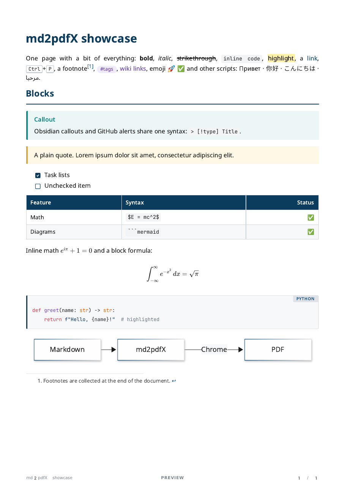
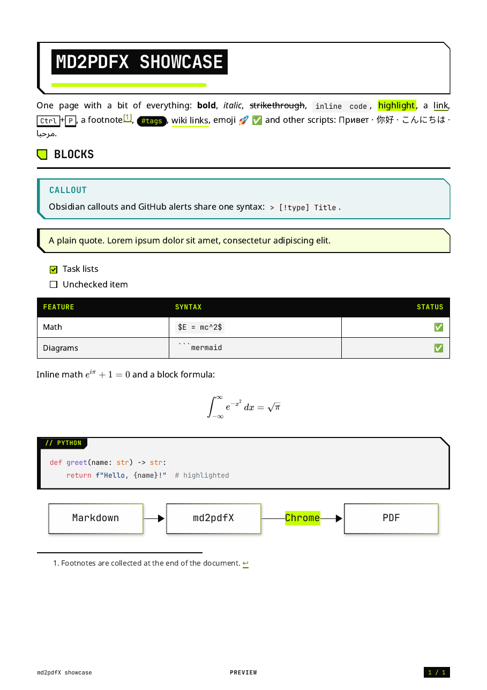
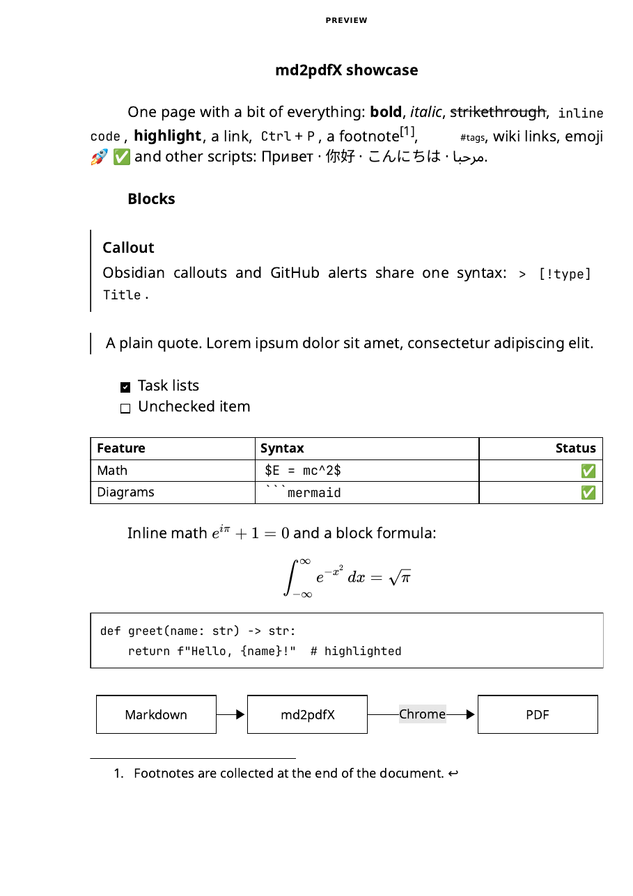
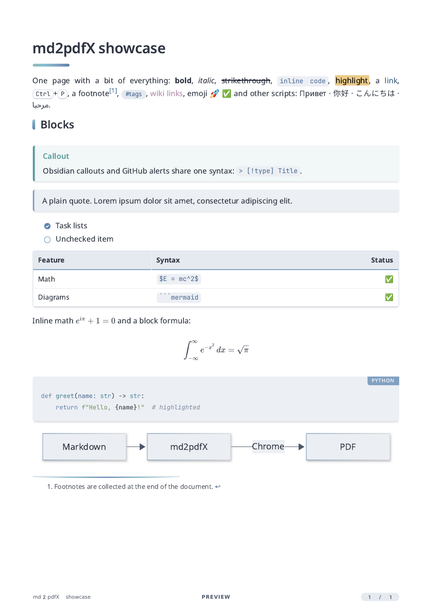
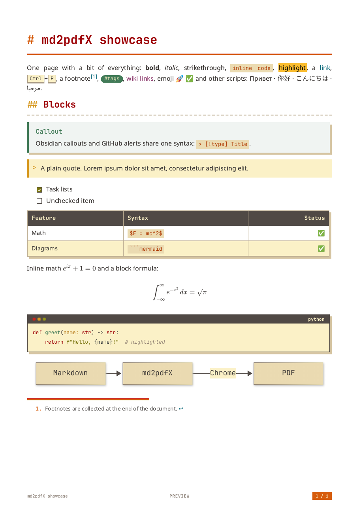

md2pdf
======


Markdown → PDF: GitHub Flavored Markdown, Obsidian syntax, Mermaid diagrams,
LaTeX formulas. A4 pages with "N / M" page numbers and the document title in
the footer.

markdown-it parses the Markdown, KaTeX renders the formulas, and headless
Chrome draws the mermaid.js diagrams and prints the PDF. No external tools
(pandoc, LaTeX) are needed, so the app builds into a single executable.

Themes
------

<!-- Ширина столбцов задана явно: иначе GitHub подгоняет их под длину
     заголовков, и картинка в столбце с длинным заголовком выходит крупнее. -->
<table>
  <tr>
    <th width="33%"><code>classic</code> (default)</th>
    <th width="33%"><code>vectorheart</code> (Neo/Vectorheart)</th>
    <th width="33%"><code>gost</code> (ГОСТ Р 7.0.97-2025)</th>
  </tr>
  <tr>
    <td width="33%"></td>
    <td width="33%"></td>
    <td width="33%"></td>
  </tr>
  <tr>
    <th width="33%"><code>nord</code> (Nord Light)</th>
    <th width="33%"><code>gruvbox</code> (Gruvbox Light)</th>
    <th width="33%"></th>
  </tr>
  <tr>
    <td width="33%"></td>
    <td width="33%"></td>
    <td width="33%"></td>
  </tr>
</table>

What is supported
-----------------

| Format   | Features                                                                                            | Example                                       |
| -------- | --------------------------------------------------------------------------------------------------- | --------------------------------------------- |
| GitHub   | tables, task lists `- [ ]`, footnotes, alerts `> [!NOTE]`, emoji `:rocket:`, autolinks, `<details>`, code highlighting, GitHub-style heading anchors | [github.md](examples/github.md)               |
| Obsidian | properties (frontmatter), `[[links]]`, `![[embeds]]` of notes, sections and images, callouts, `==highlights==`, `#tags`, `%%comments%%` | [obsidian.md](examples/obsidian.md)           |
| Mermaid  | every mermaid 12 diagram type                                                                       | [mermaid.md](examples/mermaid.md)             |
| LaTeX    | `$…$`, `$$…$$`, ` ```math ` blocks                                                                  | [math.md](examples/math.md)                   |
| Numbered formulas | `\label{key}` numbers a formula (1), (2), … or `\tag{45}`; `\eqref{key}` links to it          | [equations.md](examples/equations.md)         |
| Charts   | bar/line, sankey, quadrant, radar, treemap, timeline, journey, venn                                  | [charts.md](examples/charts.md)               |
| Engineering | architecture, C4, block, packet, gitGraph, kanban, requirements, ishikawa                         | [engineering.md](examples/engineering.md)     |
| Scripts  | 15 writing systems, right-to-left text, color emoji, Nerd Font icons in code                         | [languages.md](examples/languages.md)         |
| Big diagrams | a diagram too big for the page moves to a landscape page, turns, wraps into rows or is cut between messages | [big-diagrams.md](examples/big-diagrams.md)   |
| Book     | linked notes exported as one PDF with chapters: `md2pdf "Around the World.md" --book`                | [book/](examples/book/Around%20the%20World.md) |
| All together | a typical technical document                                                                    | [backend-guide.md](examples/backend-guide.md) |
| Lecture notes | formulas, charts, callouts and footnotes in one article                                        | [science.md](examples/science.md)             |

VS Code extension
-----------------

The **md2pdfX: Export to PDF** command is available from the editor title of
`.md` files, the editor and Explorer context menus (for a folder: every `.md`
in it) and the Command Palette. The PDF is written next to the source, and
unsaved edits are included. Progress and the result appear in the status bar;
details are in Output › md2pdfX.

**md2pdfX: Export to PDF with Options…** asks for the theme, orientation, text
alignment, section breaks and watermark before exporting; the current settings are
preselected, and Escape cancels. It is in the same context menus and the
Command Palette, and Alt-click (Option-click on macOS) on the editor title
button runs it. The answers apply to this export only and don't change the
settings.

**md2pdfX: Export as Book to PDF** builds one PDF from the file and every
local `.md` it links to (`[[note]]`, `[[note#heading]]`, `[text](file.md#anchor)`),
following links in those files too. Each file is a chapter starting on a new
page; links between them become jumps inside the PDF. A file already in the
book is not added again, so cyclic links just point to its chapter.

**md2pdfX: Export as Book to PDF with Options…** does the same, asking for the
options first, like Export to PDF with Options….

Install: download the `.vsix` from
[Releases](https://github.com/Kseen715/md2pdfX/releases), then in VS Code use
Extensions › "…" › Install from VSIX… or run
`code --install-extension md2pdfX-X.Y.Z.vsix`.

Settings:

| Setting                   | What it sets                                                          |
| ------------------------- | --------------------------------------------------------------------- |
| `md2pdfx.theme`           | PDF look: `classic` (default), `vectorheart` (Neo-Vectorheart), `gost` (ГОСТ Р 7.0.97-2025), `nord` (Nord Light) or `gruvbox` (Gruvbox Light) |
| `md2pdfx.orientation`     | page orientation: `portrait` (default) or `landscape`                 |
| `md2pdfx.align`           | text alignment: `justify` (default), `left`, `center` or `right`      |
| `md2pdfx.sections`        | `page` (default): each `##` section on a new page; `flow`: continuous |
| `md2pdfx.watermark`       | text in the middle of the footer, e.g. `CONFIDENTIAL`; empty means none |
| `md2pdfx.outputDirectory` | folder for PDFs; empty means next to the Markdown file                |
| `md2pdfx.extraCss`        | CSS applied on top of the built-in styles                             |
| `md2pdfx.chromePath`      | path to Chrome; empty means find it automatically, downloading if needed |

Relative paths resolve from the workspace folder.

Embedded files are looked up the way Obsidian does it: by name across the
whole vault. The vault root is the nearest folder containing `.obsidian`,
otherwise the document's folder.

Running from source
-------------------

Requires Node.js 22+.

```bash
npm ci                                   # once
node src/cli.js doc.md                   # → doc.pdf next to it
node src/cli.js doc.md -o /tmp/out.pdf
node src/cli.js docs/ a.md -o out/       # several files, the whole docs/ folder
npm run examples                         # examples → examples/out/
npm link                                 # puts the md2pdf command on PATH
```

In VS Code, the Extension configuration in Run and Debug opens
a window with the extension loaded from source; the default build task
(`Ctrl+Shift+B`) builds a PDF from the open file through the CLI.

```bash
npm run package:ext                      # → dist/md2pdfx-<version>.vsix
```

Options:

| Option               | What it does                                                        |
| -------------------- | ------------------------------------------------------------------- |
| `--theme <name>`     | PDF look: `classic` (default), `vectorheart`, `gost`, `nord` or `gruvbox` |
| `--watermark <text>` | text in the middle of the footer; none by default                  |
| `--css <file>`       | your own styles on top of the built-in ones ([src/style.css](src/style.css)) |
| `--orientation <o>`  | `portrait` (default) or `landscape`                                 |
| `--align <a>`        | `justify` (default), `left`, `center` or `right`                    |
| `--sections <s>`     | `page` (default): each `##` section on a new page; `flow`: continuous |
| `--book`             | one PDF with every local `.md` linked from the file, each on a new page |
| `--chrome <path>`    | which browser to use                                                |

Single executable
-----------------

Prebuilt files for Linux (x64, arm64), Windows (x64) and macOS (arm64) are on
[Releases](https://github.com/Kseen715/md2pdfX/releases): unpack
`md2pdfX-<version>-<platform>-<arch>-cli.tar.gz` (`.zip` on Windows) and run
`md2pdf doc.md`. Linux arm64 needs a system Chromium, because Google Chrome
is not released for that platform.

To build it yourself:

```bash
npm run build:exe                        # → dist/md2pdf (dist/md2pdf.exe on Windows)
./dist/md2pdf doc.md
```

Requires Node.js 25.5+ (`node --build-sea`). The file is built for the OS and
architecture the build runs on and weighs about 150 MB, since Node.js is
inside it. On macOS the build script signs the binary ad hoc
(`codesign --sign -`), otherwise macOS refuses to run it.

Chrome is bundled with neither the binary nor the extension. It is looked up
in this order: `--chrome` or `MD2PDF_CHROME` → the puppeteer cache
(`~/.cache/puppeteer`, `PUPPETEER_CACHE_DIR`) → Chrome, Chromium or Edge
installed on the system. If none is found, `chrome-headless-shell` is
downloaded into the puppeteer cache (once, about 100 MB).

Desktop app
-----------

A window for the same conversion: drop Markdown files or folders, pick a
theme and layout, export. It prints through the Chromium inside Electron, so
it needs no separate Chrome. Builds for Linux, Windows and macOS, each for x64
and arm64, are on
[Releases](https://github.com/Kseen715/md2pdfX/releases):

- Linux: `sh md2pdfX-<version>-linux-<arch>.run` installs into
  `~/.local/share/md2pdfX` with `md2pdfX` and `md2pdf` in `~/.local/bin`;
  run it with `sudo` to install into `/opt/md2pdfX` and `/usr/local/bin` for
  everyone. It adds a menu entry. To remove it, run `uninstall.sh` in the
  install folder.
- Windows: `md2pdfX-<version>-windows-<arch>-setup.exe` installs for the
  current user without admin rights, adds a Start menu entry, and adds the app
  folder to the user `PATH`. Uninstall from Settings → Apps.
- Any platform: unpack `md2pdfX-<version>-<platform>-<arch>.tar.gz` (`.zip`
  on Windows) and run `md2pdfX` (`md2pdfX.exe`, `md2pdfX.app`). The macOS app
  is signed ad hoc only: after downloading, clear the quarantine flag with
  `xattr -cr md2pdfX.app`, or macOS will call it damaged.

The app also works as the command-line tool, with the same options as
`md2pdf`. It doesn't need Chrome, but it is larger and starts more slowly than
the `-cli` binary. Use the `md2pdf` command in the app folder (`md2pdf.cmd` on
Windows). The installers put it on `PATH`.

```bash
md2pdf notes.md -o out/                  # no window; on Linux also without a display (headless)
```

Running `md2pdfX` itself with arguments also works on macOS and on a Linux
desktop. On Windows the command prompt doesn't wait for `md2pdfX.exe` and
doesn't get its exit code, so use `md2pdf.cmd` there.

```bash
npm run gui                              # run from source
npm run build:gui                        # → dist/gui/md2pdfX-<platform>-<arch>/, x64 and arm64
node scripts/build.js installer          # → dist/gui/*.run (Linux) or *-setup.exe (Windows, needs NSIS)
```

Layout
------

- Fonts are bundled, so a PDF looks the same on any machine (all under the
  SIL Open Font License 1.1): Noto Sans for text, with Noto Sans for Arabic,
  Hebrew, Devanagari, Bengali, Tamil, Thai, Georgian, Armenian, Ethiopic and
  CJK (SC, JP, KR) as fallbacks; JetBrainsMono Nerd Font for code (Nerd Font
  icons included, ligatures off); Noto Color Emoji. Only the glyphs a document
  uses end up in the PDF. The footer is drawn separately by Chrome and uses
  system fonts.
- Every `##` section except the first starts on a new page. `---` rules around
  `##` headings are hidden, other rules are shown. To break a page anywhere:
  `<div style="page-break-after: always;"></div>`.
- A single line break does not break a paragraph, as on GitHub. In Obsidian
  this matches the "Strict line breaks" setting turned on.
- Collapsed `<details>` and `[!note]-` callouts are printed expanded.

Markup pitfalls
---------------

- A heading written as `1. Title` is read by Markdown as a **list item**, not
  a heading, both in the PDF and on GitHub. Write `## 1. Title`.
- Very long labels in Mermaid diagrams stretch the diagram. A diagram that
  would shrink below 60% gets a landscape page of its own in a portrait
  document, together with the heading and intro above it. If it doesn't fit
  there either, it is redrawn in the other direction (top-down ⇄
  left-right), with the dagre layout instead of ELK, or both. Failing that,
  it is cut across into page-high pieces, each as wide as the diagram. Pieces are
  harder to read than one diagram: break long labels with `<br/>`, move
  extra participants into the text, split big diagrams yourself.
- A `[[Note]]` link to a note that is not embedded in the document stays plain
  text in the PDF: there is nowhere for it to point.
