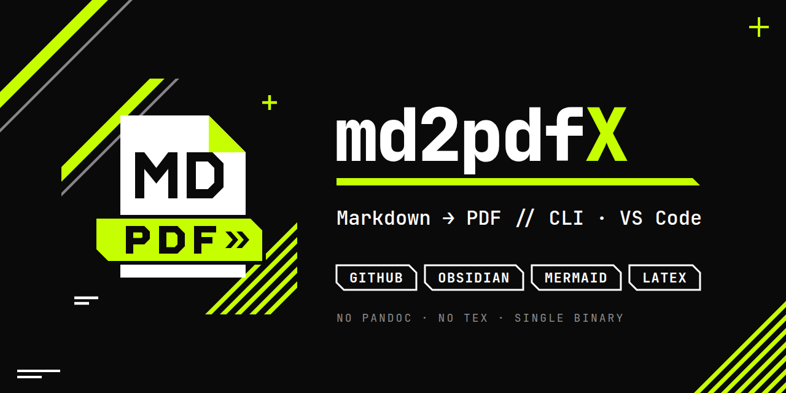

md2pdf
======



Markdown → PDF: GitHub Flavored Markdown, Obsidian syntax, Mermaid diagrams,
LaTeX formulas. A4 pages with "N / M" page numbers and the document title in
the footer.

markdown-it parses the Markdown, KaTeX renders the formulas, and headless
Chrome draws the mermaid.js diagrams and prints the PDF. No external tools
(pandoc, LaTeX) are needed, so the app builds into a single executable.

What is supported
-----------------

| Format   | Features                                                                                            | Example                                       |
| -------- | --------------------------------------------------------------------------------------------------- | --------------------------------------------- |
| GitHub   | tables, task lists `- [ ]`, footnotes, alerts `> [!NOTE]`, emoji `:rocket:`, autolinks, `<details>`, code highlighting, GitHub-style heading anchors | [github.md](examples/github.md)               |
| Obsidian | properties (frontmatter), `[[links]]`, `![[embeds]]` of notes, sections and images, callouts, `==highlights==`, `#tags`, `%%comments%%` | [obsidian.md](examples/obsidian.md)           |
| Mermaid  | every mermaid 12 diagram type                                                                       | [mermaid.md](examples/mermaid.md)             |
| LaTeX    | `$…$`, `$$…$$`, ` ```math ` blocks                                                                  | [math.md](examples/math.md)                   |
| All together | a typical technical document                                                                    | [backend-guide.md](examples/backend-guide.md) |

The examples are written in Russian.

VS Code extension
-----------------

The **md2pdfX: Export to PDF** command is available from the editor title of
`.md` files, the editor and Explorer context menus (for a folder: every `.md`
in it) and the Command Palette. The PDF is written next to the source, and
unsaved edits are included. Progress and the result appear in the status bar;
details are in Output › md2pdfX.

**md2pdfX: Export to PDF with Options…** asks for the theme, orientation, text
alignment and watermark before exporting; the current settings are
preselected, and Escape cancels. It is in the same context menus and the
Command Palette, and Alt-click (Option-click on macOS) on the editor title
button runs it. The answers apply to this export only and don't change the
settings.

Install: download the `.vsix` from
[Releases](https://github.com/Kseen715/md2pdfX/releases), then in VS Code use
Extensions › "…" › Install from VSIX… or run
`code --install-extension md2pdfX-X.Y.Z.vsix`.

Settings:

| Setting                   | What it sets                                                          |
| ------------------------- | --------------------------------------------------------------------- |
| `md2pdfx.theme`           | PDF look: `classic` (default) or `vectorheart` (Neo-Vectorheart)             |
| `md2pdfx.orientation`     | page orientation: `portrait` (default) or `landscape`                 |
| `md2pdfx.align`           | text alignment: `justify` (default), `left`, `center` or `right`      |
| `md2pdfx.watermark`       | text in the middle of the footer, e.g. `CONFIDENTIAL`; empty means none |
| `md2pdfx.outputDirectory` | folder for PDFs; empty means next to the Markdown file                |
| `md2pdfx.extraCss`        | CSS applied on top of the built-in styles                             |
| `md2pdfx.chromePath`      | path to Chrome; empty means find it automatically, downloading if needed |

Relative paths resolve from the workspace folder.

Embedded files are looked up the way Obsidian does it: by name across the
whole vault. The vault root is the nearest folder containing `.obsidian`,
otherwise the document's folder.

Running from source
-------------------

Requires Node.js 22+.

```bash
npm ci                                   # once
node src/cli.js doc.md                   # → doc.pdf next to it
node src/cli.js doc.md -o /tmp/out.pdf
node src/cli.js docs/ a.md -o out/       # several files, the whole docs/ folder
npm run examples                         # examples → examples/out/
npm link                                 # puts the md2pdf command on PATH
```

In VS Code, the "Расширение" (Extension) configuration in Run and Debug opens
a window with the extension loaded from source; the default build task
(`Ctrl+Shift+B`) builds a PDF from the open file through the CLI.

```bash
npm run package:ext                      # → dist/md2pdfx-<version>.vsix
```

Options:

| Option               | What it does                                                        |
| -------------------- | ------------------------------------------------------------------- |
| `--theme <name>`     | PDF look: `classic` (default) or `vectorheart`                            |
| `--watermark <text>` | text in the middle of the footer; none by default                  |
| `--css <file>`       | your own styles on top of the built-in ones ([src/style.css](src/style.css)) |
| `--orientation <o>`  | `portrait` (default) or `landscape`                                 |
| `--align <a>`        | `justify` (default), `left`, `center` or `right`                    |
| `--chrome <path>`    | which browser to use                                                |

Single executable
-----------------

Prebuilt files for Linux (x64, arm64), Windows (x64) and macOS (arm64) are on
[Releases](https://github.com/Kseen715/md2pdfX/releases): unpack
`md2pdfX-<version>-<platform>-<arch>.tar.gz` (`.zip` on Windows) and run
`md2pdf doc.md`. Linux arm64 needs a system Chromium, because Google Chrome
is not released for that platform.

To build it yourself:

```bash
npm run build:exe                        # → dist/md2pdf (dist/md2pdf.exe on Windows)
./dist/md2pdf doc.md
```

Requires Node.js 25.5+ (`node --build-sea`). The file is built for the OS and
architecture the build runs on and weighs about 150 MB, since Node.js is
inside it. On macOS the build script signs the binary ad hoc
(`codesign --sign -`), otherwise macOS refuses to run it.

Chrome is bundled with neither the binary nor the extension. It is looked up
in this order: `--chrome` or `MD2PDF_CHROME` → the puppeteer cache
(`~/.cache/puppeteer`, `PUPPETEER_CACHE_DIR`) → Chrome, Chromium or Edge
installed on the system. If none is found, `chrome-headless-shell` is
downloaded into the puppeteer cache (once, about 100 MB).

Builds and releases
-------------------

- **Nightly** ([nightly.yml](.github/workflows/nightly.yml)): every commit and
  PR is checked by building the examples and packaging the `.vsix`. A commit
  to `main` publishes a GitHub pre-release tagged `vYYYYMMDD.N` (N is the
  build number within the day) with the `.vsix` and executables for every
  platform. The version inside such a `.vsix` comes from `package.json`.
- **Release** ([release.yml](.github/workflows/release.yml)): started manually
  (Actions › release › Run workflow). It takes the version from
  `package.json` and creates the `vX.Y.Z` release with the `.vsix` and the
  executables. Before running it, bump `version` in `package.json` and update
  `CHANGELOG.md`: if a release with that version already exists, the workflow
  stops.

No secrets are needed: the built-in GitHub token is enough. The extension is
not published to the VS Code Marketplace.

The social media image is [.github/social-preview.png](.github/social-preview.png)
(its `.svg` source is next to it); upload it under Settings › General ›
Social preview.

Layout
------

- Fonts are bundled, so a PDF looks the same on any machine (all under the
  SIL Open Font License 1.1): Noto Sans for text, with Noto Sans for Arabic,
  Hebrew, Devanagari, Bengali, Tamil, Thai, Georgian, Armenian, Ethiopic and
  CJK (SC, JP, KR) as fallbacks; JetBrainsMono Nerd Font for code (Nerd Font
  icons included, ligatures off); Noto Color Emoji. Only the glyphs a document
  uses end up in the PDF. The footer is drawn separately by Chrome and uses
  system fonts.
- Two themes: `classic`, the default (blue headings, sans-serif text;
  [src/themes/classic.css](src/themes/classic.css)), and `vectorheart`
  (Neo-Vectorheart: black and white with an acid-lime accent, 45° cuts,
  monospace headings; [src/themes/vectorheart.css](src/themes/vectorheart.css)).
  Both sit on top of the shared layout in [src/style.css](src/style.css).
  Mermaid diagrams and the footer follow the theme. The footer shows the
  document title, the watermark if set, and "N / M" page numbers.
- Every `##` section except the first starts on a new page. `---` rules around
  `##` headings are hidden, other rules are shown. To break a page anywhere:
  `<div style="page-break-after: always;"></div>`.
- A single line break does not break a paragraph, as on GitHub. In Obsidian
  this matches the "Strict line breaks" setting turned on.
- Collapsed `<details>` and `[!note]-` callouts are printed expanded.

Markup pitfalls
---------------

- A heading written as `1. Title` is read by Markdown as a **list item**, not
  a heading, both in the PDF and on GitHub. Write `## 1. Title`.
- Very long labels in Mermaid diagrams stretch the diagram, which then shrinks
  to fit the page width and becomes unreadable. Break long labels with
  `<br/>` and move extra participants into the text.
- A `[[Note]]` link to a note that is not embedded in the document stays plain
  text in the PDF: there is nowhere for it to point.

Project layout
--------------

| File                                       | What it does                                        |
| ------------------------------------------ | --------------------------------------------------- |
| [src/cli.js](src/cli.js)                   | CLI: argument parsing, file iteration               |
| [src/extension.js](src/extension.js)       | VS Code extension                                   |
| [src/markdown.js](src/markdown.js)         | markdown-it, GFM plugins, KaTeX, mermaid, anchors   |
| [src/obsidian.js](src/obsidian.js)         | Obsidian syntax                                     |
| [src/pdf.js](src/pdf.js)                   | HTML page and printing through Chrome               |
| [src/browser.js](src/browser.js)           | finding or downloading Chrome                       |
| [src/assets.js](src/assets.js)             | styles and scripts: from node_modules or the binary |
| [scripts/build.js](scripts/build.js)       | extension and executable bundles                    |
