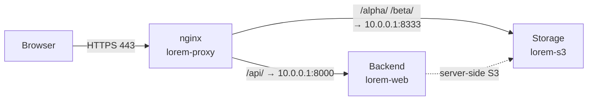
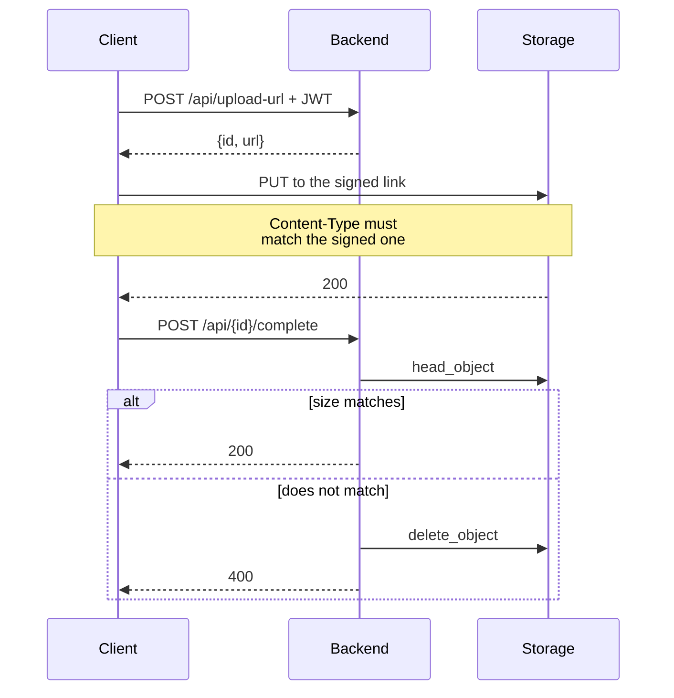

Lorem ipsum — developer guide
=============================

Lorem ipsum dolor sit amet, **consectetur adipiscing elit, sed do eiusmod
tempor**. Ut enim ad minim veniam, quis nostrud exercitation ullamco laboris
nisi ut aliquip ex ea commodo consequat.

Duis aute irure dolor in reprehenderit (see the neighboring `README.md`); here —
only what you need to know from the application side.

Contents
--------

1. [Lorem ipsum dolor](#1-lorem-ipsum-dolor)
2. [Two entry points](#2-two-entry-points)
3. [Consectetur adipiscing](#3-consectetur-adipiscing)
4. [Sed do eiusmod](#4-sed-do-eiusmod)
5. [Processes](#5-processes)
6. [Limitations](#6-limitations)

---

## 1. Lorem ipsum dolor

---

**Lorem ipsum** (`lorem server -ipsum -s3`) — dolor sit amet, consectetur
adipiscing elit. Sed do eiusmod tempor incididunt ut labore et dolore magna
aliqua: ut enim ad minim veniam, quis nostrud exercitation.

| Bucket      | What it stores    | Access model                                 |
| ----------- | ----------------- | -------------------------------------------- |
| `alpha`     | lorem ipsum       | server-side writes only, reads by link       |
| `beta`      | dolor sit amet    | reads and writes by signed link              |

Network diagram:



The key point: **storage listens only on the internal address** (`10.0.0.1`).
Excepteur sint occaecat cupidatat non proident, sunt in culpa qui officia.

---

## 2. Two entry points

---

Sed ut perspiciatis unde omnis iste natus error sit voluptatem accusantium
doloremque laudantium:

- `http://10.0.0.1:8333` — internal. Nemo enim ipsam voluptatem:
  `put_object`, `head_object`, `delete_object`.
- `https://files.example.org` — public. Used **only for signing URLs**.

```python
# lorem/clients.py
import boto3
from botocore.config import Config

_cfg = Config(signature_version="s3v4", s3={"addressing_style": "path"})

# Neque porro quisquam est, qui dolorem ipsum quia dolor sit amet.
presign_client = boto3.client("s3", endpoint_url="https://files.example.org", config=_cfg)
internal_client = boto3.client("s3", endpoint_url="http://10.0.0.1:8333", config=_cfg)
```

---

## 3. Consectetur adipiscing

---

**There is no anonymous access.** Ut enim ad minima veniam, quis nostrum
exercitationem ullam corporis suscipit laboriosam.

| Credential         | Where it applies    | Who checks it        |
| ------------------ | ------------------- | -------------------- |
| Signed link        | `/alpha/`, `/beta/` | storage              |
| HTTP Basic         | everything else     | nginx                |

```bash
ssh <host> 'cat /opt/lorem/secrets.yml'
```

> **Lorem is a temporary measure.** Quis autem vel eum iure reprehenderit qui
> in ea voluptate velit esse quam nihil molestiae consequatur (see §6).

### Deviation from the specification

At vero eos et accusamus et iusto odio dignissimos ducimus qui blanditiis
praesentium voluptatum deleniti atque corrupti.

---

## 4. Sed do eiusmod

---

### Environment variables

```bash
S3_INTERNAL_ENDPOINT=http://10.0.0.1:8333
S3_PUBLIC_BASE_URL=https://files.example.org
S3_ACCESS_KEY=<lorem>
S3_SECRET_KEY=<ipsum>
```

### settings.py

```python
STORAGES = {
    "default": {
        "BACKEND": "storages.backends.s3.S3Storage",
        "OPTIONS": {"bucket_name": "beta", "querystring_auth": True},
    },
}
```

---

## 5. Processes

---

### 5.1 Upload through the application

Temporibus autem quibusdam et aut officiis debitis aut rerum necessitatibus.


### 5.2 Direct upload in three steps



---

## 6. Limitations

---

| Topic         | What matters                                                                 |
| ------------- | ---------------------------------------------------------------------------- |
| `Host`        | Nam libero tempore, cum soluta nobis est eligendi optio cumque nihil impedit |
| Content-Type  | Itaque earum rerum hic tenetur a sapiente delectus, otherwise `403`          |
| Size          | `client_max_body_size 20m`. Larger — `413`                                   |

- **Backups.** Lorem ipsum dolor sit amet.
- **Quotas** — count them in the application.
