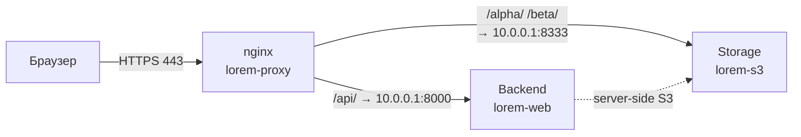
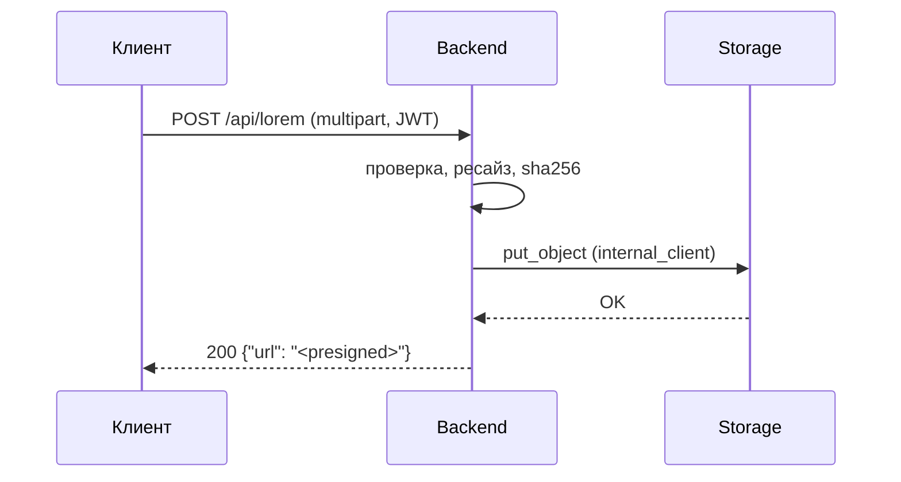

Lorem ipsum — руководство для разработчика
===========================================

Lorem ipsum dolor sit amet, **consectetur adipiscing elit, sed do eiusmod
tempor**. Ut enim ad minim veniam, quis nostrud exercitation ullamco laboris
nisi ut aliquip ex ea commodo consequat.

Duis aute irure dolor in reprehenderit (см. соседний `README.md`); здесь —
только то, что нужно знать со стороны приложения.

Содержание
----------

1. [Lorem ipsum dolor](#1-lorem-ipsum-dolor)
2. [Две точки входа](#2-две-точки-входа)
3. [Consectetur adipiscing](#3-consectetur-adipiscing)
4. [Sed do eiusmod](#4-sed-do-eiusmod)
5. [Процессы](#5-процессы)
6. [Ограничения](#6-ограничения)

---

## 1. Lorem ipsum dolor

---

**Lorem ipsum** (`lorem server -ipsum -s3`) — dolor sit amet, consectetur
adipiscing elit. Sed do eiusmod tempor incididunt ut labore et dolore magna
aliqua: ut enim ad minim veniam, quis nostrud exercitation.

| Бакет       | Что хранит        | Модель доступа                               |
| ----------- | ----------------- | -------------------------------------------- |
| `alpha`     | lorem ipsum       | запись только server-side, чтение по ссылке  |
| `beta`      | dolor sit amet    | чтение и запись по подписанной ссылке        |

Схема сети:



Ключевой момент: **хранилище слушает только внутренний адрес** (`10.0.0.1`).
Excepteur sint occaecat cupidatat non proident, sunt in culpa qui officia.

---

## 2. Две точки входа

---

Sed ut perspiciatis unde omnis iste natus error sit voluptatem accusantium
doloremque laudantium:

- `http://10.0.0.1:8333` — внутренний. Nemo enim ipsam voluptatem:
  `put_object`, `head_object`, `delete_object`.
- `https://files.example.org` — публичный. Используется **только для
  подписи URL**.

```python
# lorem/clients.py
import boto3
from botocore.config import Config

_cfg = Config(signature_version="s3v4", s3={"addressing_style": "path"})

# Neque porro quisquam est, qui dolorem ipsum quia dolor sit amet.
presign_client = boto3.client("s3", endpoint_url="https://files.example.org", config=_cfg)
internal_client = boto3.client("s3", endpoint_url="http://10.0.0.1:8333", config=_cfg)
```

---

## 3. Consectetur adipiscing

---

**Анонимного доступа нет.** Ut enim ad minima veniam, quis nostrum
exercitationem ullam corporis suscipit laboriosam.

| Основание          | Где применяется     | Кто проверяет        |
| ------------------ | ------------------- | -------------------- |
| Подписанная ссылка | `/alpha/`, `/beta/` | хранилище            |
| HTTP Basic         | всё остальное       | nginx                |

```bash
ssh <host> 'cat /opt/lorem/secrets.yml'
```

> **Lorem — временная мера.** Quis autem vel eum iure reprehenderit qui in ea
> voluptate velit esse quam nihil molestiae consequatur (см. §6).

### Расхождение со спецификацией

At vero eos et accusamus et iusto odio dignissimos ducimus qui blanditiis
praesentium voluptatum deleniti atque corrupti.

---

## 4. Sed do eiusmod

---

### Переменные окружения

```bash
S3_INTERNAL_ENDPOINT=http://10.0.0.1:8333
S3_PUBLIC_BASE_URL=https://files.example.org
S3_ACCESS_KEY=<lorem>
S3_SECRET_KEY=<ipsum>
```

### settings.py

```python
STORAGES = {
    "default": {
        "BACKEND": "storages.backends.s3.S3Storage",
        "OPTIONS": {"bucket_name": "beta", "querystring_auth": True},
    },
}
```

---

## 5. Процессы

---

### 5.1 Загрузка — через приложение

Temporibus autem quibusdam et aut officiis debitis aut rerum necessitatibus.



### 5.2 Загрузка напрямую — три шага


---

## 6. Ограничения

---

| Тема          | Что важно                                                                   |
| ------------- | --------------------------------------------------------------------------- |
| `Host`        | Nam libero tempore, cum soluta nobis est eligendi optio cumque nihil impedit |
| Content-Type  | Itaque earum rerum hic tenetur a sapiente delectus, иначе `403`             |
| Размер        | `client_max_body_size 20m`. Больше — `413`                                   |

- **Резервное копирование.** Lorem ipsum dolor sit amet.
- **Квоты** — считать в приложении.
