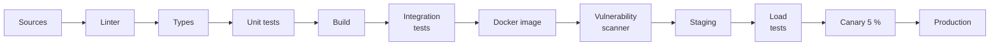
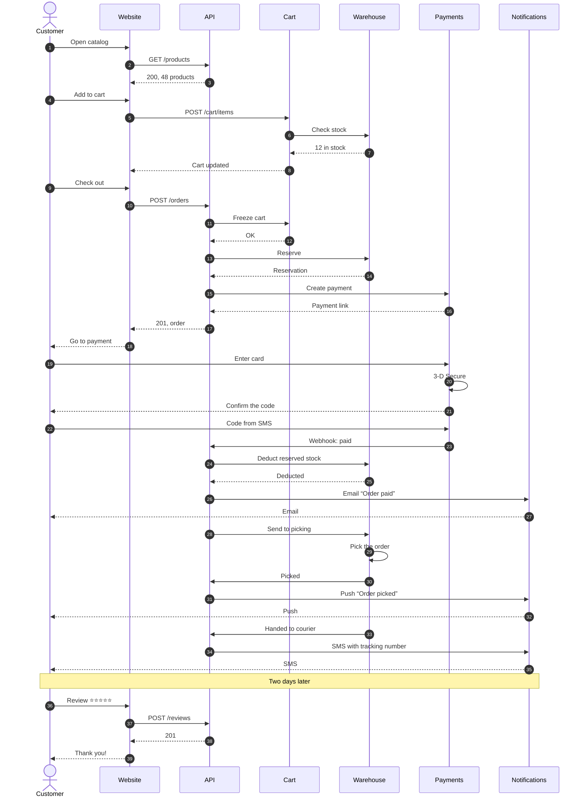

# Big diagrams

A diagram that does not fit the page does not turn into unreadable specks.
md2pdfX tries in turn: a landscape page → another direction (top-down ⇄
left-right) → another layout → snake wrapping → and only then cuts it into
pieces by page height. Nothing to configure.

## Wide: turns top-down

A twelve-step build pipeline in one row is smaller than 60 % even on a
landscape page, so its steps stack one under another, and it stays on a
portrait page.

## Very long: wraps like a snake

The same pipeline together with incident review — twenty-four steps. It fits
neither in a row nor in a column on any page, so instead of being cut across
pages the chain wraps like a snake: row after row, and every arrow, including
the ones between rows, stays whole.

## Long: cut across pages

Services talking during checkout — forty messages. The diagram is cut only
horizontally and only between messages, so no arrow or label is split.

