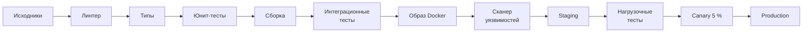
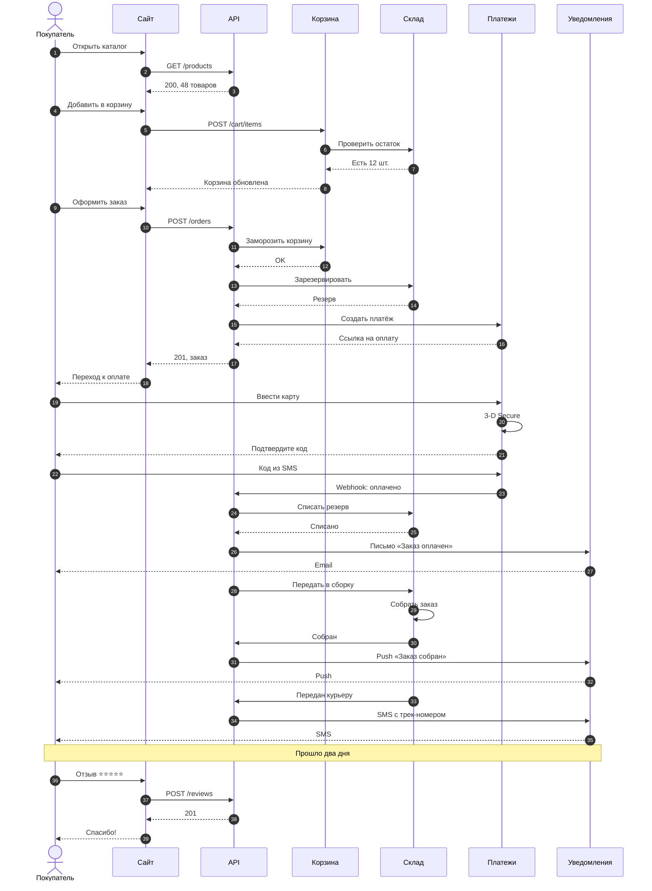

# Большие диаграммы

Диаграмма, которая не влезает в лист, не превращается в нечитаемую мелочь.
md2pdfX по очереди пробует: альбомный лист → другое направление (сверху
вниз ⇄ слева направо) → другую раскладку → и только потом режет её на
куски по высоте листа. Ничего настраивать не нужно.

## Широкая: уходит на альбомный лист

Конвейер сборки из двенадцати шагов в одну строку — на книжном листе он стал
бы мельче 60 %, поэтому получает альбомный лист вместе с этим абзацем и
заголовком.

## Длинная: режется по листам

Переписка сервисов при оформлении заказа — сорок сообщений. Диаграмма
режется только поперёк и только между сообщениями, так что ни одна стрелка
и подпись не разрываются.

