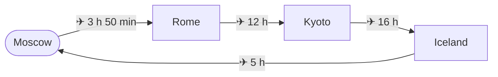
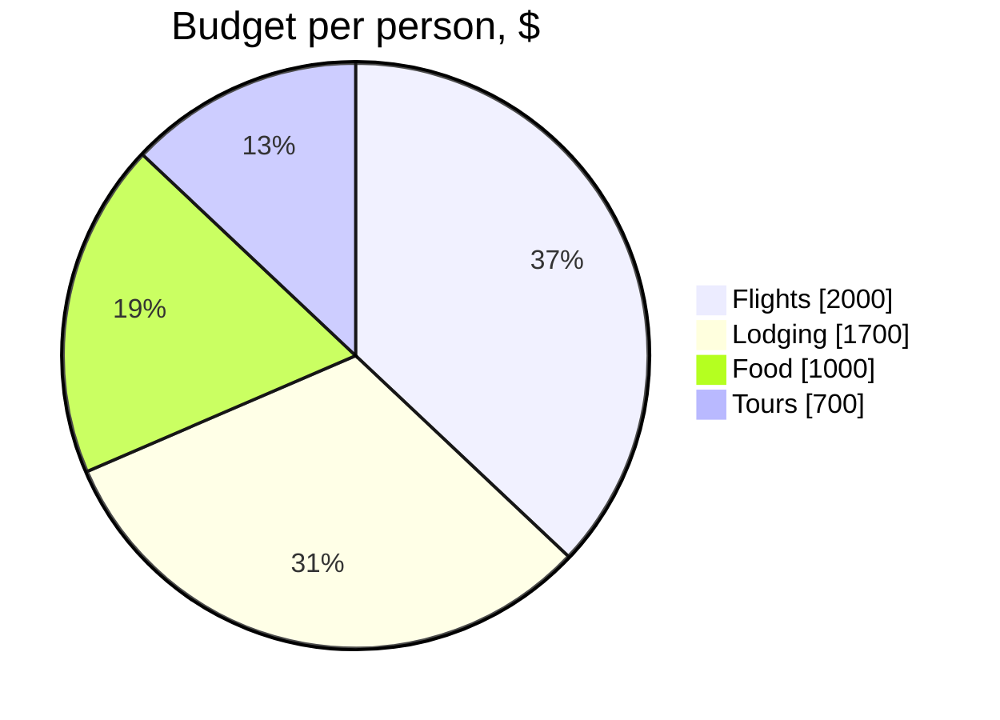

# Around the World in 30 Days

A travel guide made of four notes. Export this file with
**md2pdfX: Export as Book to PDF** (or `md2pdf "Around the World.md" --book`) —
and every note it links to is collected into one book: each one is a chapter
starting on a new page, and the links between them become jumps inside the PDF.

## Route

| Days  | Where        | Highlights                           |
| :---: | :----------- | :----------------------------------- |
| 1–9   | [[Rome]]     | the Colosseum, pasta, Trevi Fountain |
| 10–20 | [[Kyoto]]    | temples, sakura, tea ceremony        |
| 21–30 | [[Iceland]]  | geysers, glaciers, northern lights   |

What to pack is in the chapter [packing list](Iceland.md#what-to-pack):
it is the coldest stop.

## Budget

