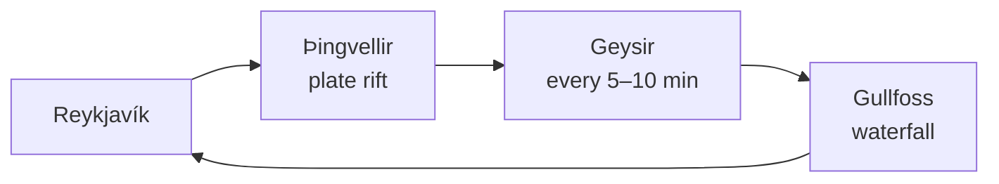

# Iceland 🇮🇸

The land of ice and fire: glaciers sit next to volcanoes, and hot springs next
to snowdrifts.

## Golden Circle

## Northern lights

The geomagnetic activity index $K_p$ runs from 0 to 9. The aurora is visible
at $K_p \ge 3$ if the sky is clear and there is no city light pollution.

> [!warning] The weather changes in minutes
> Check vedur.is and road.is before every trip.

## What to pack

- [ ] Thermal underwear and a wool sweater (a lopapeysa — buy it there)
- [ ] Waterproof jacket and trousers
- [ ] Swimsuit — for the Blue Lagoon
- [ ] Headlamp: in December there are only 4 hours of daylight

The journey is over — back to the [[Around the World|beginning]].
