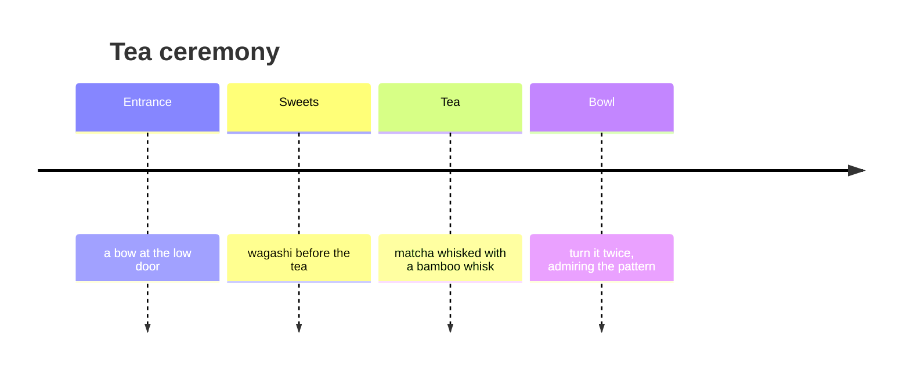

# Kyoto 🇯🇵

古都 — “the old capital”: a thousand years of Japanese history and 1,600 temples.

## Sakura

The blossom lasts about a week, and its forecast is published like a weather
forecast. The best spot is the Philosopher's Path (哲学の道).

> [!tip] Tip
> Come to Kiyomizu-dera at opening time, 6:00 — before the tour buses.

## Tea ceremony

After Japan — to the edge of the world: [[Iceland]]. And if you miss pasta —
back to [[Rome]].
