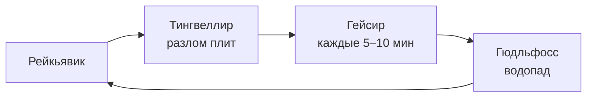

# Исландия 🇮🇸

Страна льда и огня: ледники соседствуют с вулканами, а горячие источники —
с сугробами.

## Золотое кольцо

## Северное сияние

Индекс геомагнитной активности $K_p$ от 0 до 9. Сияние видно при $K_p \ge 3$,
если небо ясное и нет городской засветки.

> [!warning] Погода меняется за минуты
> Проверяйте vedur.is и road.is перед каждой поездкой.

## Что взять с собой

- [ ] Термобельё и шерстяной свитер (лопапейса — купите на месте)
- [ ] Непромокаемая куртка и штаны
- [ ] Купальник — для Голубой лагуны
- [ ] Налобный фонарь: в декабре светло всего 4 часа

Путешествие закончено — возвращаемся к [[Кругосветка|началу]].
