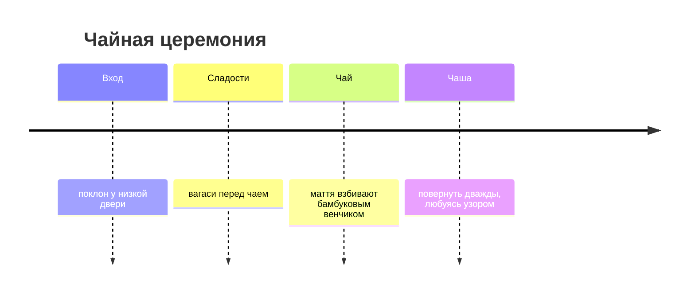

# Киото 🇯🇵

古都 — «старая столица»: тысяча лет истории Японии и 1600 храмов.

## Сакура

Цветение длится около недели, и его прогноз публикуют как прогноз погоды.
Лучшее место — Философская тропа (哲学の道).

> [!tip] Совет
> Приходите к храму Киёмидзу-дэра к открытию, в 6:00 — до туристических
> автобусов.

## Чайная церемония

После Японии — на край света: [[Исландия]]. А если скучаете по пасте —
назад в [[Рим]].
