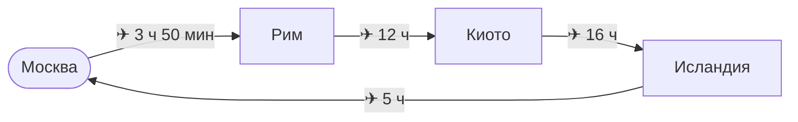
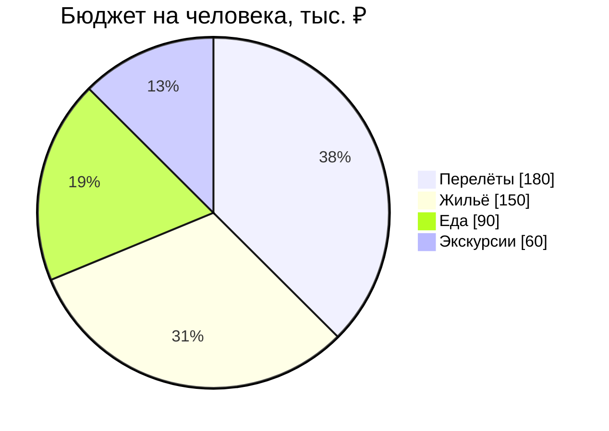

# Кругосветка за 30 дней

Путеводитель из четырёх заметок. Экспортируйте этот файл командой
**md2pdfX: Export as Book to PDF** (или `md2pdf Кругосветка.md --book`) — и
все заметки, на которые он ссылается, соберутся в одну книгу: каждая — глава
с новой страницы, а ссылки между ними станут переходами внутри PDF.

## Маршрут

| Дни   | Где                            | Главное                         |
| :---: | :----------------------------- | :------------------------------ |
| 1–9   | [[Рим]]                        | Колизей, паста, фонтан Треви    |
| 10–20 | [[Киото]]                      | храмы, сакура, чайная церемония |
| 21–30 | [[Исландия]]                   | гейзеры, ледники, северное сияние |

Что взять с собой — в главе [чемоданное настроение](Исландия.md#что-взять-с-собой):
там холоднее всего.

## Бюджет

