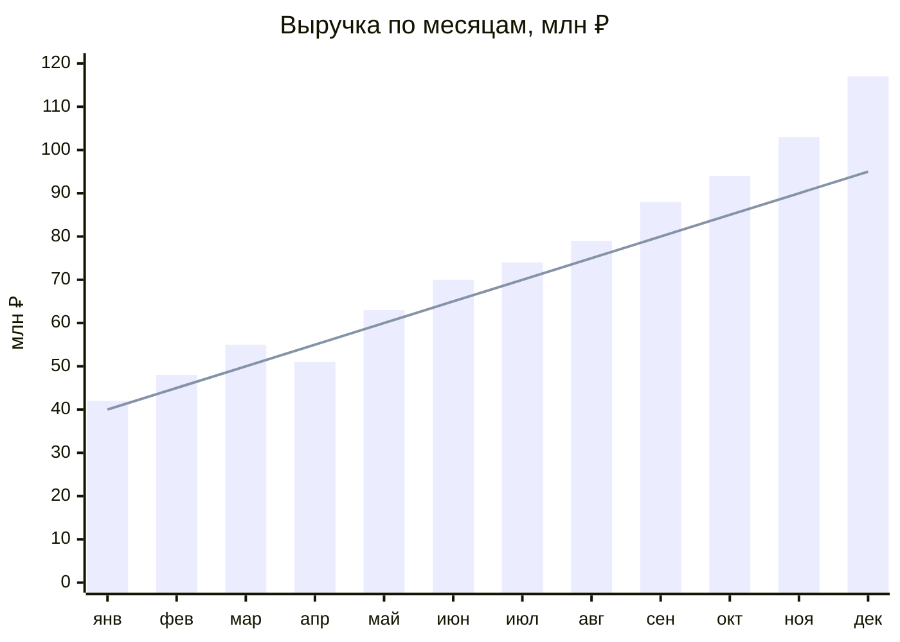
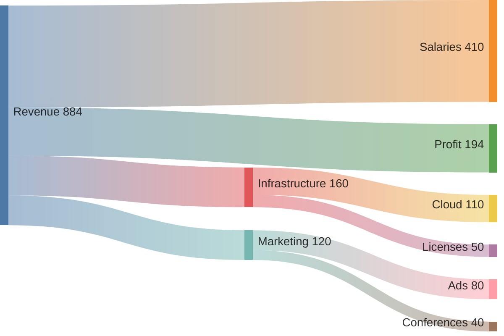
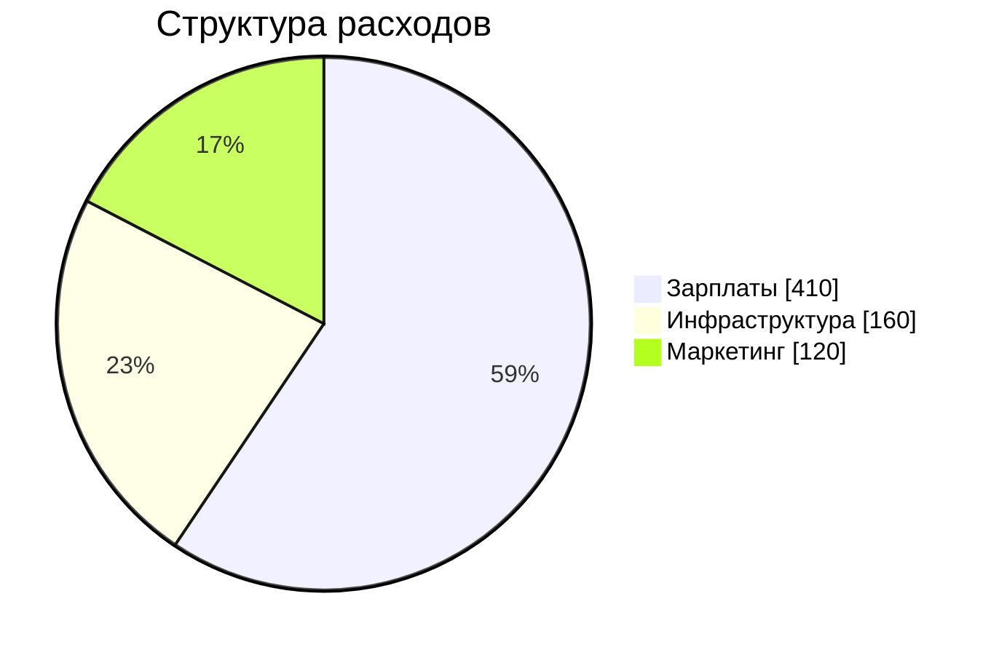
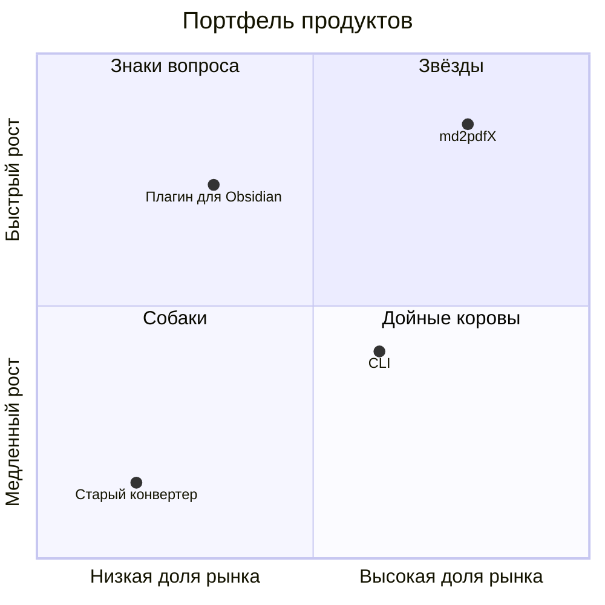
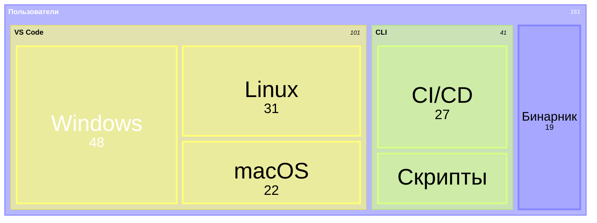
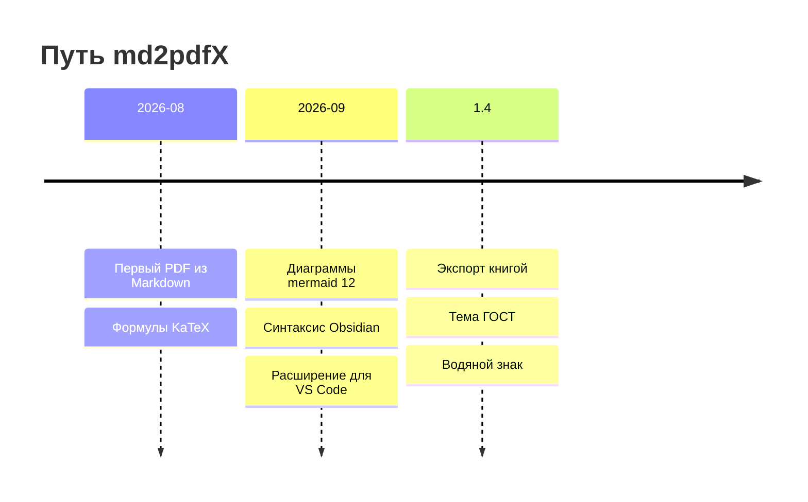
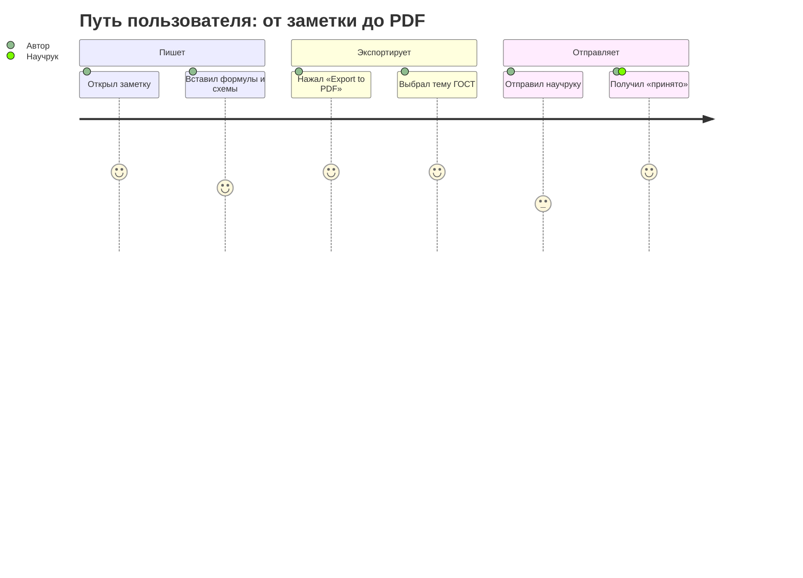
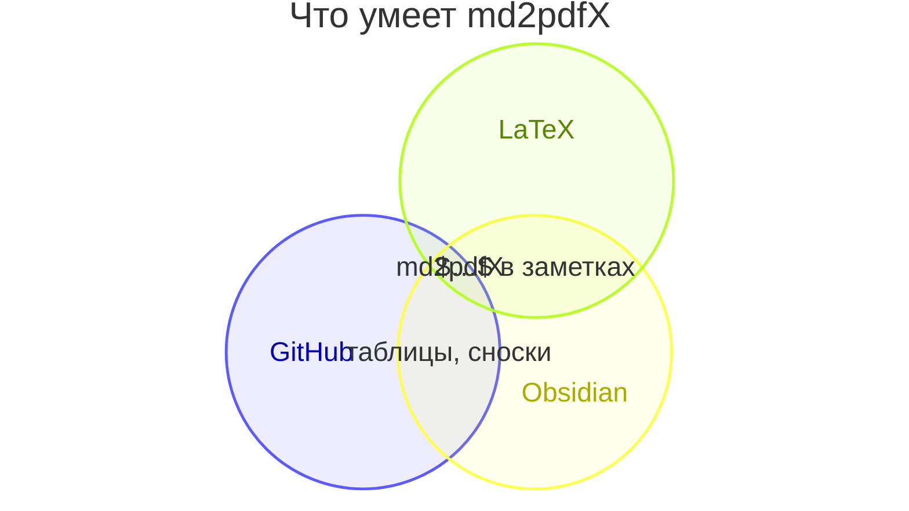

# Данные и графики

Отчёт с графиками без Excel и без картинок: всё рисует mermaid прямо из
текста, а в PDF попадает вектор — графики остаются чёткими при любом
увеличении. Цифры ниже выдуманы.

## Выручка и динамика

| Квартал | Выручка, млн ₽ | Рост к прошлому году | План выполнен |
| :------ | -------------: | -------------------: | :-----------: |
| I       |          145,0 |              +18,2 % |      ✅       |
| II      |          184,0 |              +22,7 % |      ✅       |
| III     |          241,0 |              +31,4 % |      ✅       |
| IV      |          314,0 |              +40,1 % |      🚀       |
| **Год** |      **884,0** |          **+29,6 %** |               |

## Куда уходят деньги

Диаграмма Санкея — поток денег. Её разбор в mermaid 12 понимает только
латиницу, поэтому подписи здесь английские:

## Продукты: где мы и куда идём

## История проекта

