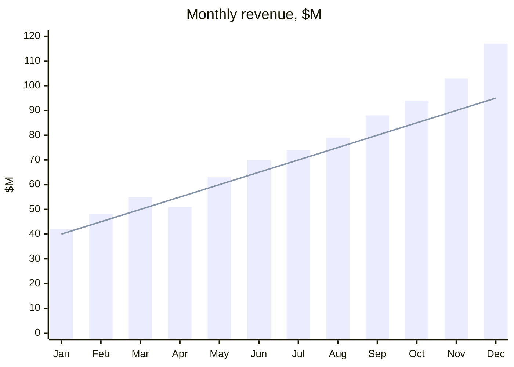
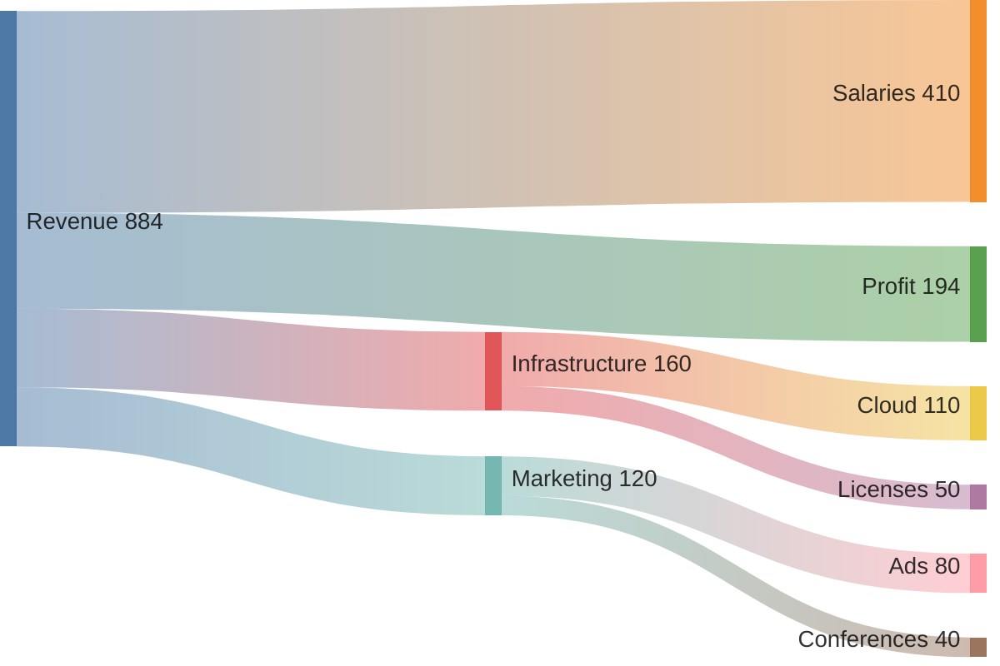
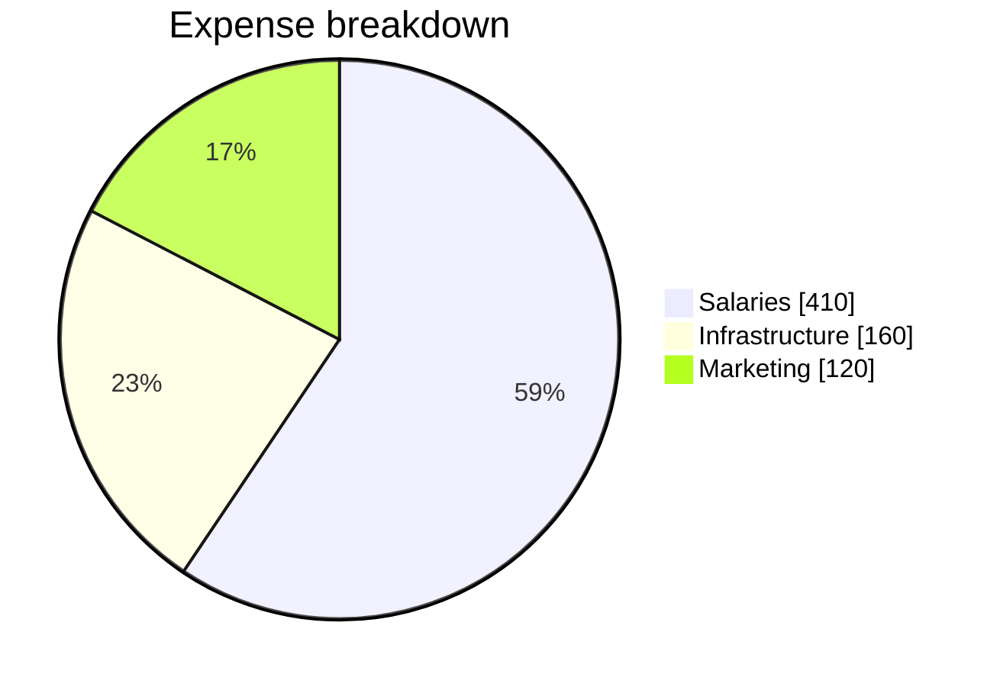
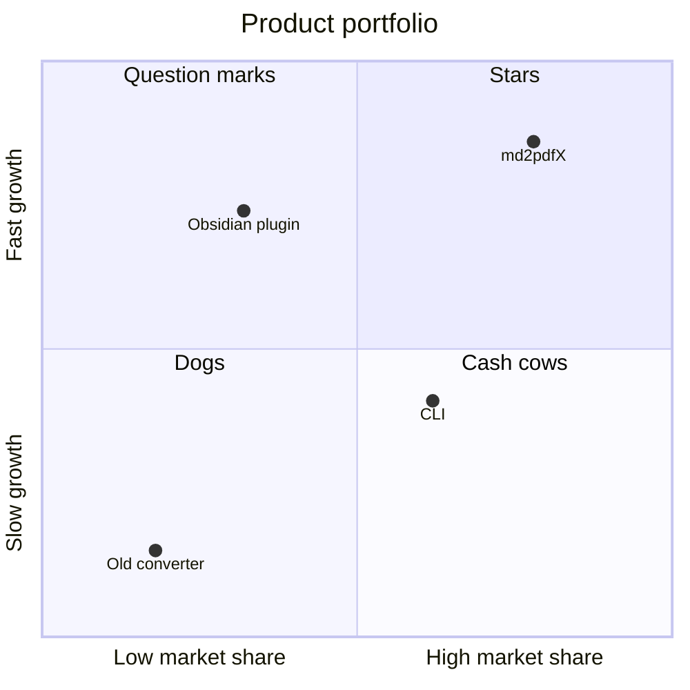
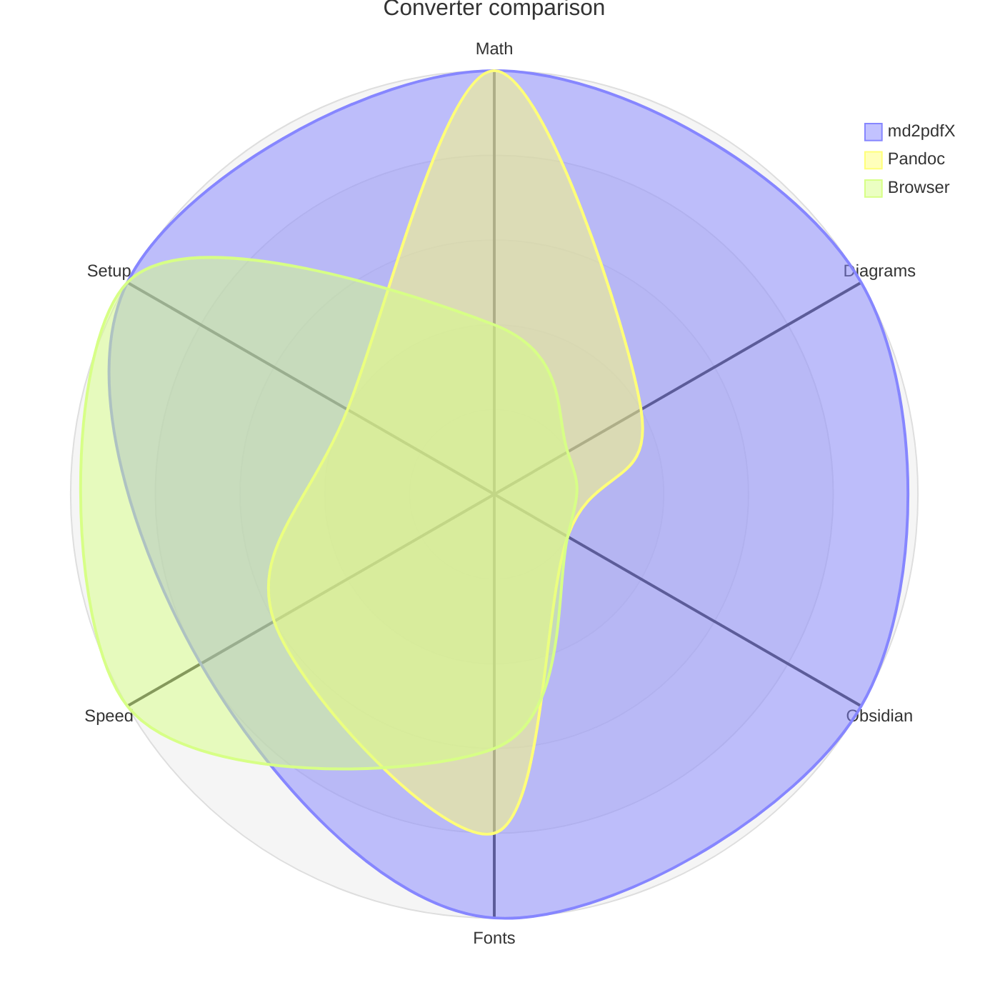
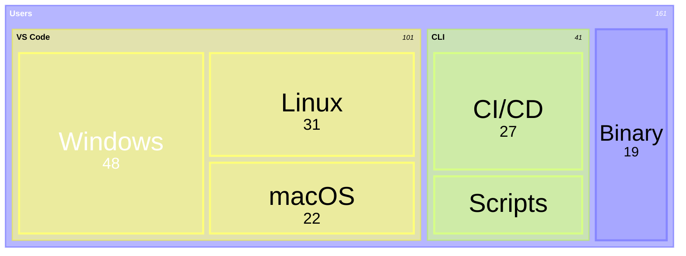
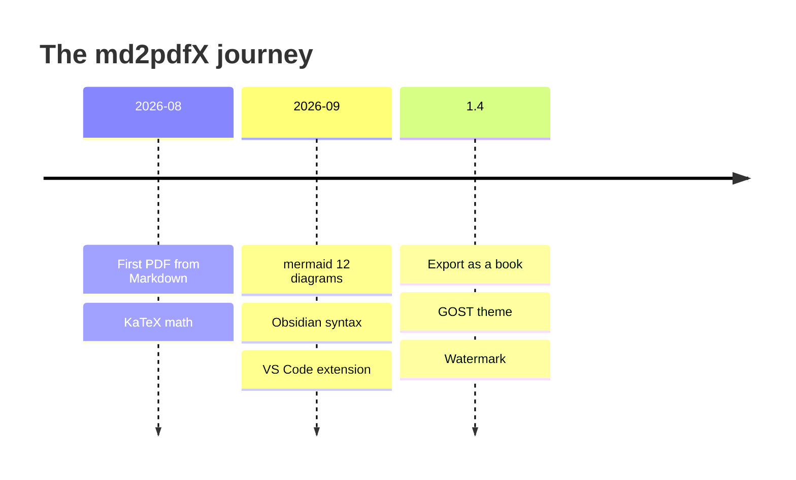
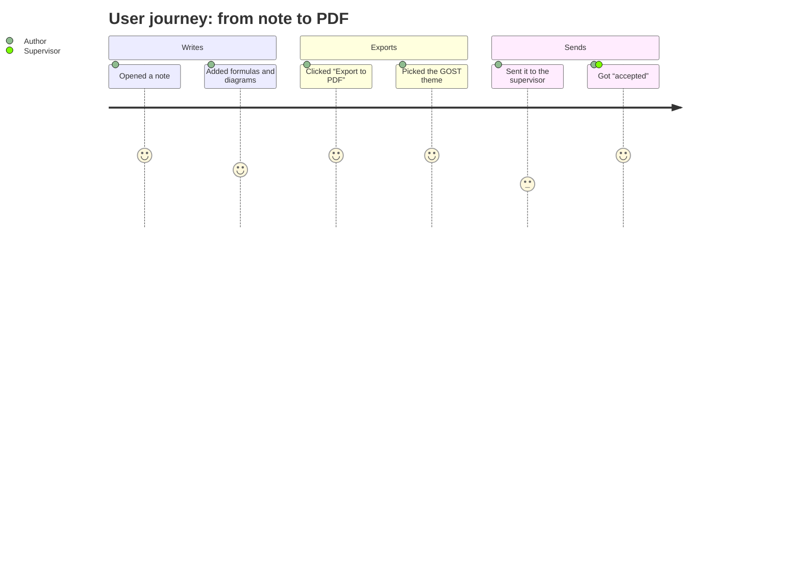
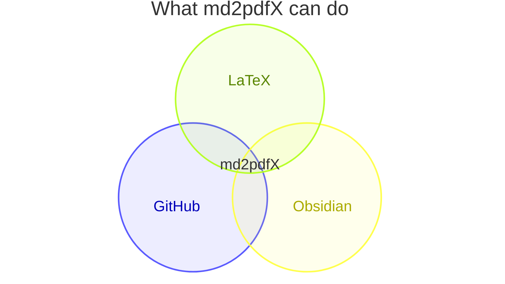

# Data and charts

A report with charts, without Excel and without images: mermaid draws
everything straight from text, and the PDF gets vectors — charts stay sharp
at any zoom. The numbers below are made up.

## Revenue and trend

| Quarter  | Revenue, $M | Year-over-year growth | Plan met |
| :------- | ----------: | --------------------: | :------: |
| Q1       |       145.0 |               +18.2 % |    ✅    |
| Q2       |       184.0 |               +22.7 % |    ✅    |
| Q3       |       241.0 |               +31.4 % |    ✅    |
| Q4       |       314.0 |               +40.1 % |    🚀    |
| **Year** |   **884.0** |           **+29.6 %** |          |

## Where the money goes

A Sankey diagram shows the flow of money. Note that its parser in mermaid 12
understands only Latin labels:

## Products: where we are and where we are going

## Project history

