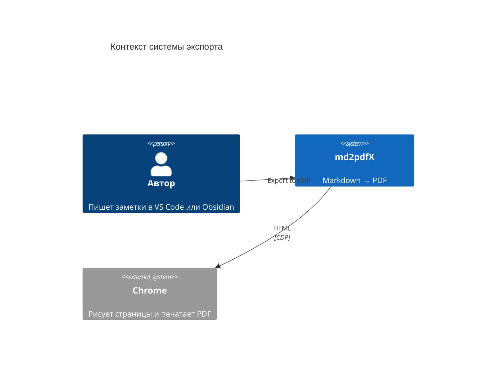
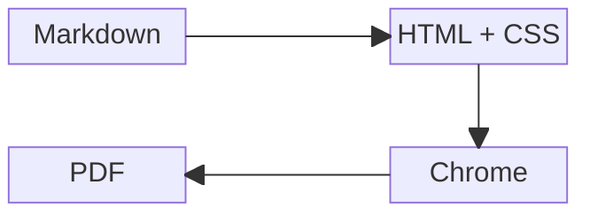
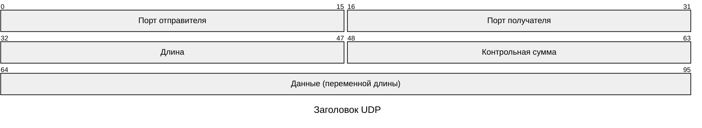
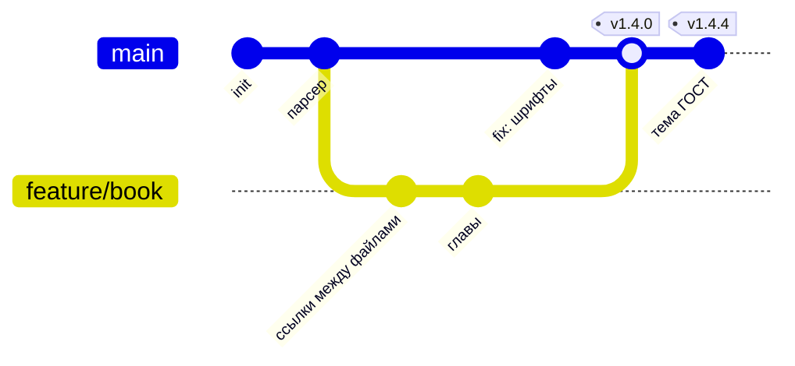
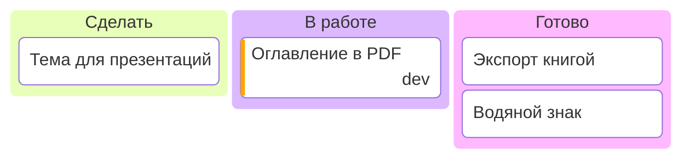
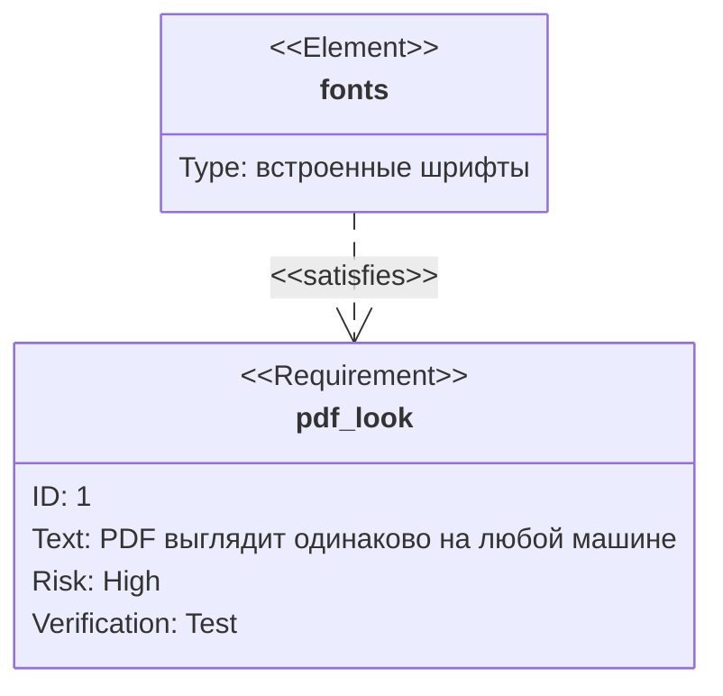
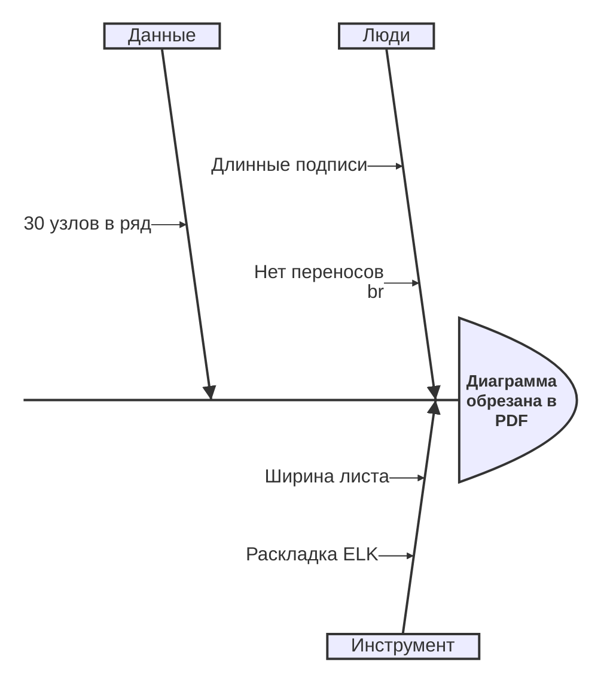

# Инженерная документация

Архитектура, протоколы, процессы и планы — в одном `.md`, который живёт в
репозитории рядом с кодом и собирается в PDF одной командой.

## Архитектура






## Протокол

Формат пакета — наглядно, до бита:



```http
POST /api/export HTTP/1.1
Host: example.org
Content-Type: application/json

{"source": "notes/отчёт.md", "theme": "gost", "watermark": "ЧЕРНОВИК"}
```

## Разработка







## Разбор инцидента



> [!success] Как md2pdfX это решает
> Диаграмма, которая не влезает, сама уходит на альбомный лист, потом
> перерисовывается в другом направлении, и только в крайнем случае режется
> на куски. См. [big-diagrams.md](big-diagrams.md).

## Код

```rust
use std::collections::HashMap;

fn word_count(text: &str) -> HashMap<&str, usize> {
    let mut counts = HashMap::new();
    for word in text.split_whitespace() {
        *counts.entry(word).or_insert(0) += 1;
    }
    counts
}
```

```go
func handler(w http.ResponseWriter, r *http.Request) {
	w.Header().Set("Content-Type", "application/pdf")
	if err := render(r.Context(), w); err != nil {
		http.Error(w, err.Error(), http.StatusInternalServerError)
	}
}
```

```sql
SELECT author, count(*) AS pages
FROM documents
WHERE exported_at > now() - interval '7 days'
GROUP BY author
ORDER BY pages DESC
LIMIT 10;
```

```yaml
# .github/workflows/docs.yml — PDF документации в каждом релизе
- run: npx md2pdf docs/ -o dist/ --theme gost --watermark "v${{ github.ref_name }}"
```
