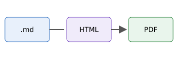

# GitHub Flavored Markdown

Пример основных возможностей GFM. Lorem ipsum dolor sit amet, consectetur
adipiscing elit.

## Текст и ссылки

**Жирный**, *курсив*, ***оба***, ~~зачёркнутый~~, `код`, <kbd>Ctrl</kbd>+<kbd>C</kbd>,
H<sub>2</sub>O, x<sup>2</sup>, эмодзи :rocket: :white_check_mark: :warning:.

- Обычная ссылка: [markdown-it](https://github.com/markdown-it/markdown-it)
- Автоссылка: https://github.com и <https://example.org>
- Якорь на заголовок с кириллицей: [Таблицы и код](#таблицы-и-код)
- Якорь на повтор заголовка: [второй «Повтор»](#повтор-1)
- Картинка по относительному пути:



### Повтор

Lorem ipsum.

### Повтор

Одинаковые заголовки получают якоря `повтор` и `повтор-1`, как на GitHub.

## Списки и задачи

1. Первый пункт
2. Второй пункт
   - вложенный маркированный
   - ещё один
     1. и нумерованный глубже
3. Третий пункт

- [x] Сделанная задача
- [ ] Несделанная задача
  - [x] вложенная задача

> Обычная цитата. Sed ut perspiciatis unde omnis iste natus error sit
> voluptatem accusantium doloremque laudantium.

## Таблицы и код

| Слева | По центру | Справа |
| :---- | :-------: | -----: |
| lorem |   ipsum   |   1.00 |
| dolor |    sit    |  10.50 |
| amet  |  `code`   | 100.25 |

```js
// Подсветка синтаксиса — highlight.js
export function slugify(text) {
  return text.trim().toLowerCase().replace(/ /g, '-');
}
```

```python
def greet(name: str) -> str:
    return f"Hello, {name}!"
```

```diff
- удалённая строка
+ добавленная строка
```

## Алерты

> [!NOTE]
> Полезная информация, которую стоит знать даже при беглом чтении.

> [!TIP]
> Совет, как сделать лучше или проще.

> [!IMPORTANT]
> Ключевая информация, необходимая для достижения цели.

> [!WARNING]
> Срочная информация, требующая немедленного внимания.

> [!CAUTION]
> Предупреждение о рисках или негативных последствиях.

## Сноски и прочее

Утверждение со сноской[^1] и ещё одной[^note].

[^1]: Текст первой сноски.
[^note]: Сноски собираются в конце документа.

<details>
<summary>Раскрывающийся блок</summary>

В PDF печатается раскрытым. Lorem ipsum dolor sit amet.

</details>

---

Горизонтальная черта выше видна: скрываются только линии вокруг `##`.
