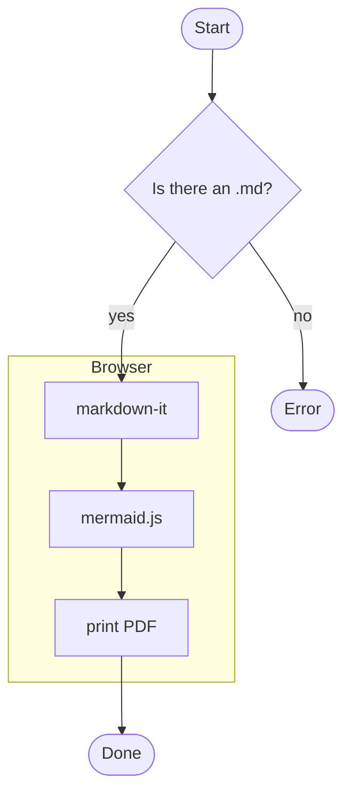
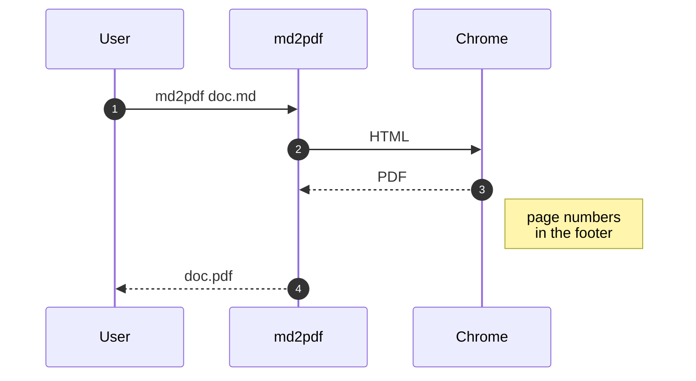
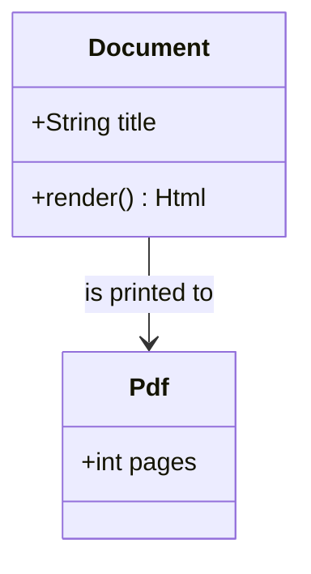
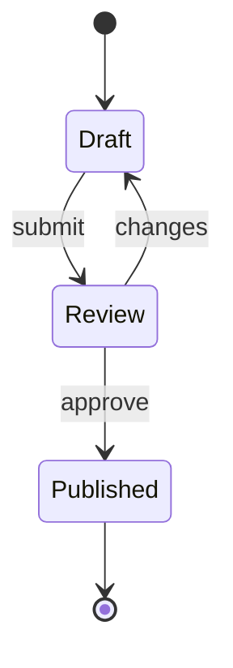
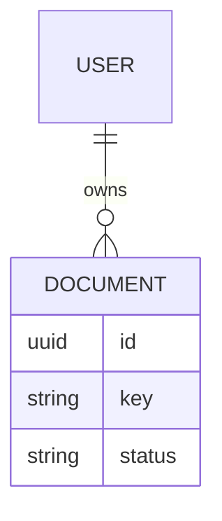
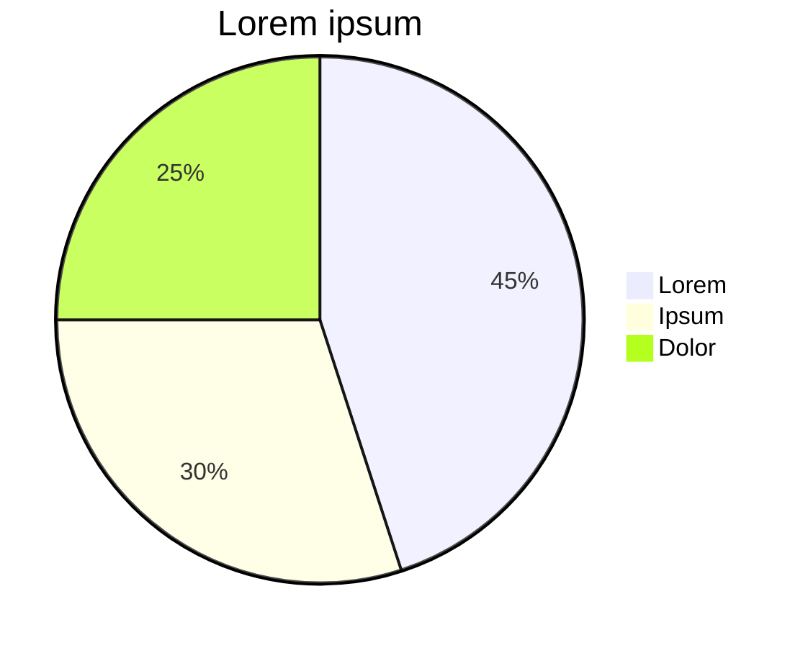

# Mermaid diagrams

A ` ```mermaid ` block turns into SVG. Break long labels with `<br/>`,
otherwise the diagram shrinks to fit the page width.

## Flowchart and sequence





## Classes, states, ER







## Charts and plans




