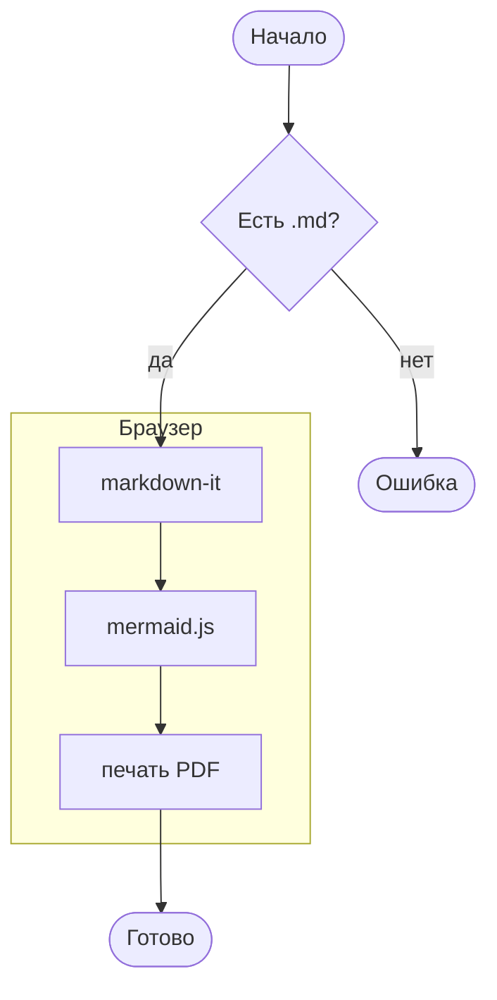
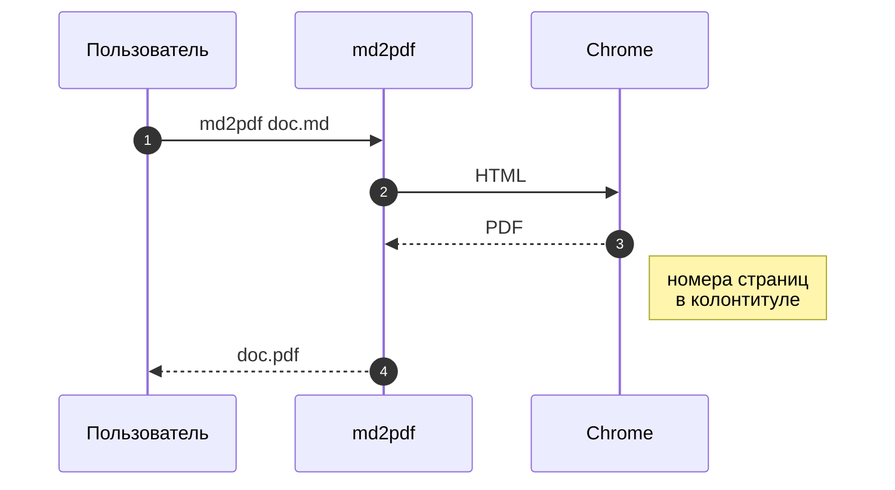
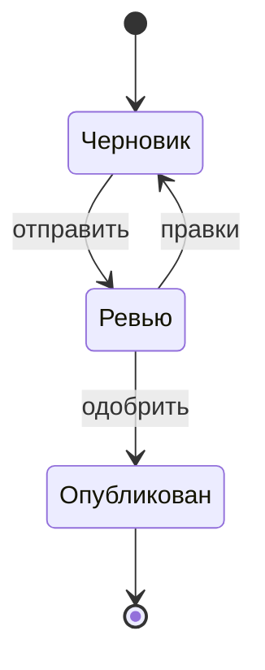
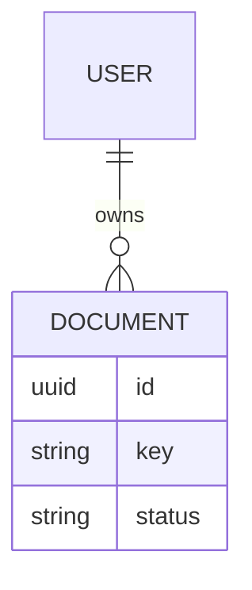
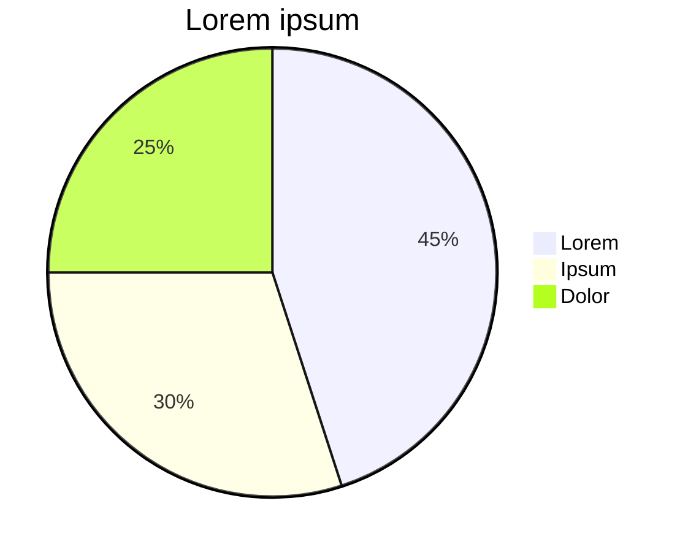
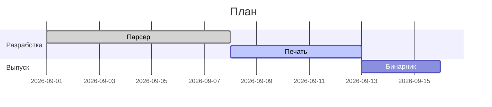
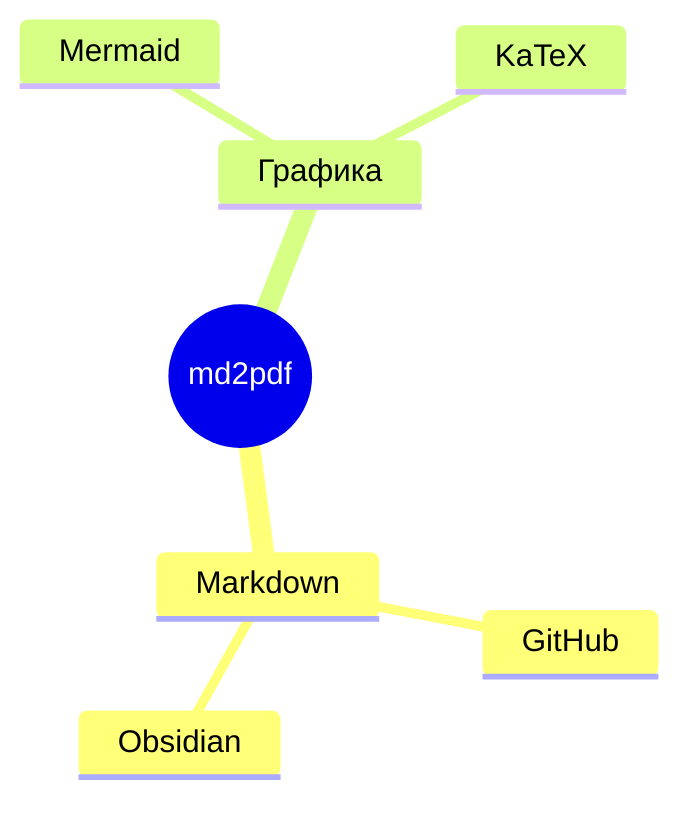

# Диаграммы Mermaid

Блок ` ```mermaid ` превращается в SVG. Длинные подписи разбивайте через
`<br/>`, иначе схема ужмётся под ширину страницы.

## Блок-схема и последовательность





## Классы, состояния, ER






## Графики и планы






