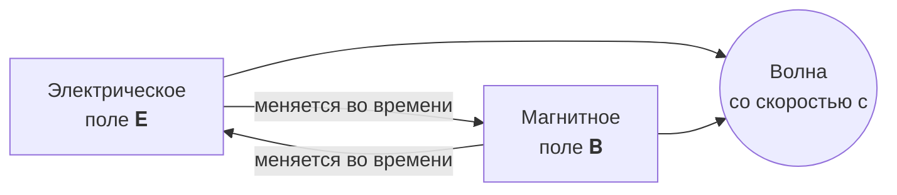
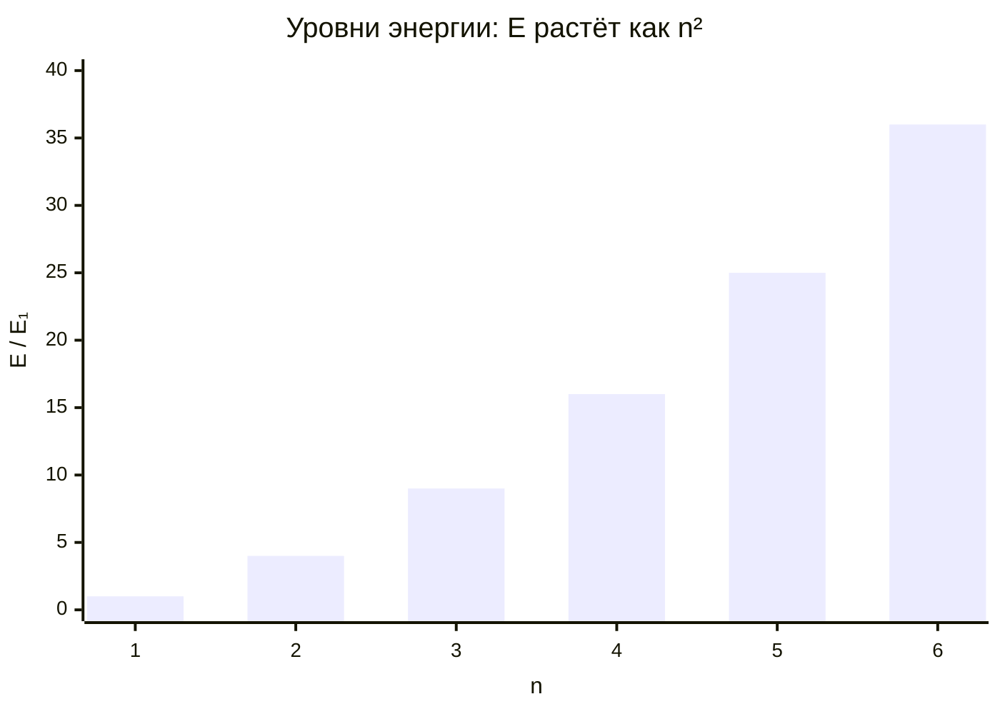
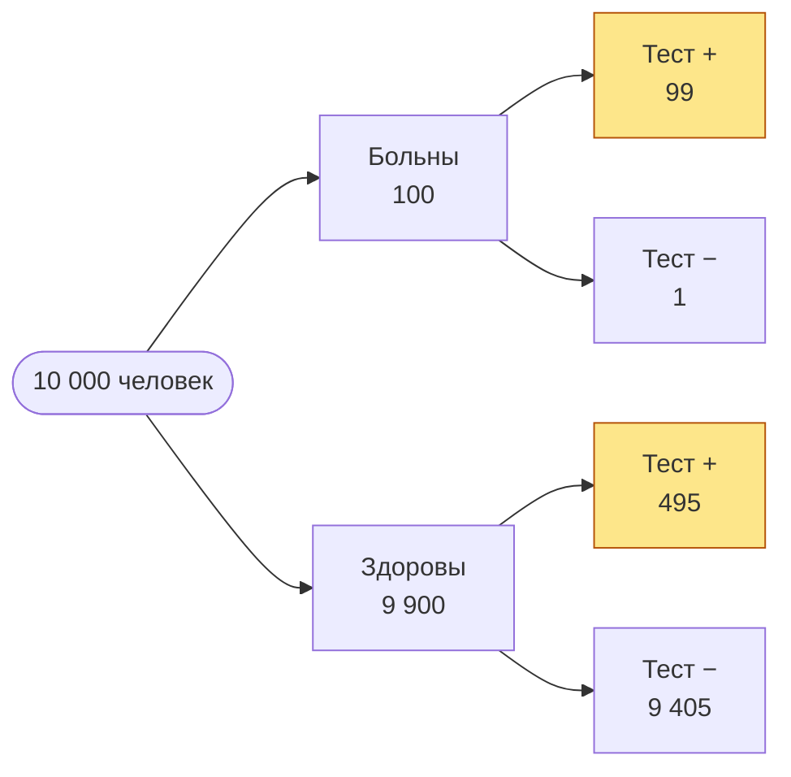

# Четыре уравнения, которые изменили мир

Конспект лекции в Markdown: формулы KaTeX, диаграммы, сноски и callout'ы.
Никакого LaTeX на машине не нужно — формулы рисуются при сборке PDF.

> [!abstract] О чём лекция
> От электромагнетизма до квантовой механики: как короткая запись описывает
> огромный класс явлений. Для каждого уравнения — смысл, вывод следствия и
> место в истории.

## 1. Уравнения Максвелла

Все электромагнитные явления — от компаса до Wi-Fi — описываются четырьмя
уравнениями[^maxwell]:

$$
\begin{aligned}
\nabla \cdot \mathbf{E} &= \frac{\rho}{\varepsilon_0} &\qquad
\nabla \cdot \mathbf{B} &= 0 \\[4pt]
\nabla \times \mathbf{E} &= -\frac{\partial \mathbf{B}}{\partial t} &\qquad
\nabla \times \mathbf{B} &= \mu_0 \mathbf{J} + \mu_0 \varepsilon_0 \frac{\partial \mathbf{E}}{\partial t}
\end{aligned}
$$

В пустоте ($\rho = 0$, $\mathbf{J} = 0$) из них следует волновое уравнение:

$$
\nabla^2 \mathbf{E} = \mu_0 \varepsilon_0 \, \frac{\partial^2 \mathbf{E}}{\partial t^2}
\quad\Longrightarrow\quad
c = \frac{1}{\sqrt{\mu_0 \varepsilon_0}} \approx 2{,}998 \cdot 10^8 \ \text{м/с}
$$

> [!tip] Главное открытие
> Скорость волны совпала со скоростью света. Значит, **свет — это
> электромагнитная волна**.



## 2. Уравнение Шрёдингера

Состояние квантовой системы — волновая функция $\Psi(\mathbf{r}, t)$, и она
эволюционирует так:

$$
i\hbar \frac{\partial}{\partial t} \Psi(\mathbf{r}, t) =
\left[ -\frac{\hbar^2}{2m} \nabla^2 + V(\mathbf{r}, t) \right] \Psi(\mathbf{r}, t)
$$

Для частицы в бесконечной яме ширины $L$ энергия квантуется:

$$
E_n = \frac{n^2 \pi^2 \hbar^2}{2 m L^2}, \qquad
\psi_n(x) = \sqrt{\frac{2}{L}} \sin\!\left(\frac{n \pi x}{L}\right), \qquad n = 1, 2, 3, \dots
$$

| $n$ | Энергия $E_n / E_1$ | Узлов у $\psi_n$ | $\langle x \rangle$ |
| :-: | ------------------: | ---------------: | :-----------------: |
|  1  |                   1 |                0 |        $L/2$        |
|  2  |                   4 |                1 |        $L/2$        |
|  3  |                   9 |                2 |        $L/2$        |
|  4  |                  16 |                3 |        $L/2$        |



## 3. Преобразование Фурье

Любой сигнал — сумма синусоид. Преобразование Фурье раскладывает его на
частоты:

$$
\hat{f}(\xi) = \int_{-\infty}^{\infty} f(x)\, e^{-2\pi i x \xi} \, dx
\qquad \Longleftrightarrow \qquad
f(x) = \int_{-\infty}^{\infty} \hat{f}(\xi)\, e^{2\pi i x \xi} \, d\xi
$$

Меандр, например, — это только нечётные гармоники:

$$
\operatorname{sq}(t) = \frac{4}{\pi} \sum_{k=0}^{\infty} \frac{\sin\big((2k+1)\,\omega t\big)}{2k+1}
= \frac{4}{\pi}\left( \sin \omega t + \frac{\sin 3\omega t}{3} + \frac{\sin 5\omega t}{5} + \cdots \right)
$$

Быстрое преобразование Фурье считает это за $O(n \log n)$ вместо $O(n^2)$:

```python
import numpy as np

t = np.linspace(0, 1, 1024, endpoint=False)
signal = np.sign(np.sin(2 * np.pi * 5 * t))       # меандр 5 Гц
spectrum = np.abs(np.fft.rfft(signal)) / len(t)
peaks = np.argsort(spectrum)[-4:][::-1]
print(peaks)                                       # [ 5 15 25 35] — нечётные гармоники
```

## 4. Теорема Байеса

Как обновлять уверенность, получив новые данные:

$$
P(H \mid D) = \frac{P(D \mid H)\, P(H)}{P(D)}
= \frac{P(D \mid H)\, P(H)}{P(D \mid H)\, P(H) + P(D \mid \neg H)\, P(\neg H)}
$$

> [!example] Задача о тесте
> Болезнь встречается у 1 % людей. Тест находит её в 99 % случаев и ошибается
> у здоровых в 5 % случаев. Тест положительный — какова вероятность болезни?
>
> $$
> P = \frac{0{,}99 \cdot 0{,}01}{0{,}99 \cdot 0{,}01 + 0{,}05 \cdot 0{,}99} = \frac{1}{6} \approx 16{,}7\,\%
> $$

> [!warning] Интуиция обманывает
> Большинство отвечает «99 %». Редкая болезнь — и ложных срабатываний у
> здоровых оказывается впятеро больше, чем верных у больных.



Из $99 + 495 = 594$ положительных тестов больны только 99 — ровно шестая
часть.

## Шпаргалка

| Уравнение    | Запись                                                          | Год  | Что дало                     |
| :----------- | :-------------------------------------------------------------- | :--: | :--------------------------- |
| Максвелл     | $\nabla \times \mathbf{E} = -\partial_t \mathbf{B}$             | 1865 | радио, электроника, свет     |
| Шрёдингер    | $i\hbar\,\partial_t \Psi = \hat{H} \Psi$                        | 1926 | транзисторы, лазеры          |
| Фурье        | $\hat{f}(\xi) = \int f(x)\, e^{-2\pi i x\xi} dx$                | 1822 | MP3, JPEG, МРТ               |
| Байес        | $P(H \mid D) \propto P(D \mid H) P(H)$                          | 1763 | спам-фильтры, машинное обучение |

- [x] Прочитать лекцию
- [ ] Решить задачу про тест с распространённостью 10 %
- [ ] Вывести $E_n$ для ямы самостоятельно

[^maxwell]: Сам Максвелл записал их в 1865 году в виде двадцати уравнений;
    компактную векторную форму придал им Оливер Хевисайд.
