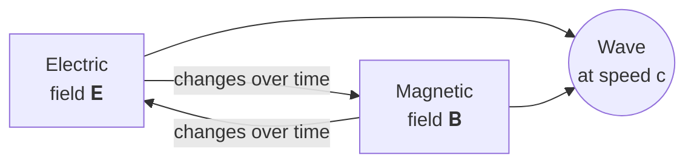
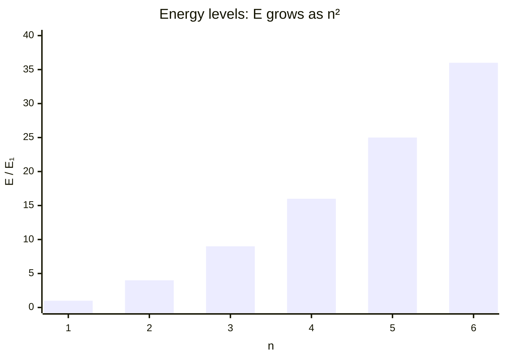

# Four equations that changed the world

Lecture notes in Markdown: KaTeX formulas, diagrams, footnotes and callouts.
No LaTeX installation needed — formulas are rendered when the PDF is built.

> [!abstract] What the lecture is about
> From electromagnetism to quantum mechanics: how a short expression
> describes a huge class of phenomena. For each equation — its meaning, a
> derived consequence and its place in history.

## 1. Maxwell's equations

All electromagnetic phenomena — from a compass to Wi-Fi — are described by
four equations[^maxwell]:

$$
\begin{aligned}
\nabla \cdot \mathbf{E} &= \frac{\rho}{\varepsilon_0} &\qquad
\nabla \cdot \mathbf{B} &= 0 \\[4pt]
\nabla \times \mathbf{E} &= -\frac{\partial \mathbf{B}}{\partial t} &\qquad
\nabla \times \mathbf{B} &= \mu_0 \mathbf{J} + \mu_0 \varepsilon_0 \frac{\partial \mathbf{E}}{\partial t}
\end{aligned}
$$

In a vacuum ($\rho = 0$, $\mathbf{J} = 0$) they lead to the wave equation:

$$
\nabla^2 \mathbf{E} = \mu_0 \varepsilon_0 \, \frac{\partial^2 \mathbf{E}}{\partial t^2}
\quad\Longrightarrow\quad
c = \frac{1}{\sqrt{\mu_0 \varepsilon_0}} \approx 2.998 \cdot 10^8 \ \text{m/s}
$$

> [!tip] The key discovery
> The speed of the wave matched the speed of light. So **light is an
> electromagnetic wave**.



## 2. The Schrödinger equation

The state of a quantum system is a wave function $\Psi(\mathbf{r}, t)$, and
it evolves like this:

$$
i\hbar \frac{\partial}{\partial t} \Psi(\mathbf{r}, t) =
\left[ -\frac{\hbar^2}{2m} \nabla^2 + V(\mathbf{r}, t) \right] \Psi(\mathbf{r}, t)
$$

For a particle in an infinite well of width $L$ the energy is quantized:

$$
E_n = \frac{n^2 \pi^2 \hbar^2}{2 m L^2}, \qquad
\psi_n(x) = \sqrt{\frac{2}{L}} \sin\!\left(\frac{n \pi x}{L}\right), \qquad n = 1, 2, 3, \dots
$$

| $n$ | Energy $E_n / E_1$ | Nodes of $\psi_n$ | $\langle x \rangle$ |
| :-: | -----------------: | ----------------: | :-----------------: |
|  1  |                  1 |                 0 |        $L/2$        |
|  2  |                  4 |                 1 |        $L/2$        |
|  3  |                  9 |                 2 |        $L/2$        |
|  4  |                 16 |                 3 |        $L/2$        |



## 3. The Fourier transform

Any signal is a sum of sine waves. The Fourier transform breaks it down into
frequencies:

$$
\hat{f}(\xi) = \int_{-\infty}^{\infty} f(x)\, e^{-2\pi i x \xi} \, dx
\qquad \Longleftrightarrow \qquad
f(x) = \int_{-\infty}^{\infty} \hat{f}(\xi)\, e^{2\pi i x \xi} \, d\xi
$$

A square wave, for example, has only odd harmonics:

$$
\operatorname{sq}(t) = \frac{4}{\pi} \sum_{k=0}^{\infty} \frac{\sin\big((2k+1)\,\omega t\big)}{2k+1}
= \frac{4}{\pi}\left( \sin \omega t + \frac{\sin 3\omega t}{3} + \frac{\sin 5\omega t}{5} + \cdots \right)
$$

The fast Fourier transform computes this in $O(n \log n)$ instead of $O(n^2)$:

```python
import numpy as np

t = np.linspace(0, 1, 1024, endpoint=False)
signal = np.sign(np.sin(2 * np.pi * 5 * t))       # 5 Hz square wave
spectrum = np.abs(np.fft.rfft(signal)) / len(t)
peaks = np.argsort(spectrum)[-4:][::-1]
print(peaks)                                       # [ 5 15 25 35] — odd harmonics
```

## 4. Bayes' theorem

How to update your confidence after getting new data:

$$
P(H \mid D) = \frac{P(D \mid H)\, P(H)}{P(D)}
= \frac{P(D \mid H)\, P(H)}{P(D \mid H)\, P(H) + P(D \mid \neg H)\, P(\neg H)}
$$

> [!example] The test problem
> A disease affects 1 % of people. A test detects it in 99 % of cases and
> gives a false positive for 5 % of healthy people. The test is positive —
> what is the probability of the disease?
>
> $$
> P = \frac{0.99 \cdot 0.01}{0.99 \cdot 0.01 + 0.05 \cdot 0.99} = \frac{1}{6} \approx 16.7\,\%
> $$

> [!warning] Intuition misleads
> Most people answer “99 %”. The disease is rare — so false positives among
> the healthy outnumber true positives among the sick five to one.


Out of $99 + 495 = 594$ positive tests only 99 are sick — exactly one in six.

## Cheat sheet

| Equation     | Form                                                            | Year | What it gave us              |
| :----------- | :-------------------------------------------------------------- | :--: | :--------------------------- |
| Maxwell      | $\nabla \times \mathbf{E} = -\partial_t \mathbf{B}$             | 1865 | radio, electronics, light    |
| Schrödinger  | $i\hbar\,\partial_t \Psi = \hat{H} \Psi$                        | 1926 | transistors, lasers          |
| Fourier      | $\hat{f}(\xi) = \int f(x)\, e^{-2\pi i x\xi} dx$                | 1822 | MP3, JPEG, MRI               |
| Bayes        | $P(H \mid D) \propto P(D \mid H) P(H)$                          | 1763 | spam filters, machine learning |

- [x] Read the lecture
- [ ] Solve the test problem with a 10 % prevalence
- [ ] Derive $E_n$ for the well yourself

[^maxwell]: Maxwell himself wrote them down in 1865 as twenty equations;
    Oliver Heaviside gave them their compact vector form.
