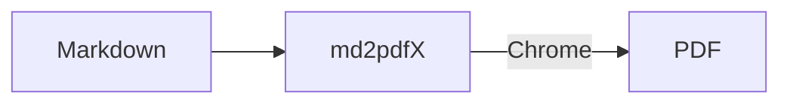

# md2pdfX showcase

One page with a bit of everything: **bold**, *italic*, ~~strikethrough~~,
`inline code`, ==highlight==, a [link](https://github.com/Kseen715/md2pdfX),
<kbd>Ctrl</kbd>+<kbd>P</kbd>, a footnote[^1], #tags, [[wiki links]], emoji 🚀 ✅
and other scripts: Привет · 你好 · こんにちは · مرحبا.

## Blocks

> [!tip] Callout
> Obsidian callouts and GitHub alerts share one syntax: `> [!type] Title`.

> A plain quote. Lorem ipsum dolor sit amet, consectetur adipiscing elit.

- [x] Task lists
- [ ] Unchecked item

| Feature  | Syntax          | Status |
| :------- | :-------------- | -----: |
| Math     | `$E = mc^2$`    |     ✅ |
| Diagrams | ` ```mermaid `  |     ✅ |

Inline math $e^{i\pi} + 1 = 0$ and a block formula:

$$
\int_{-\infty}^{\infty} e^{-x^2}\,dx = \sqrt{\pi}
$$

```python
def greet(name: str) -> str:
    return f"Hello, {name}!"  # highlighted
```



[^1]: Footnotes are collected at the end of the document.
